<link rel="stylesheet" href="{{ '/vintage-story/forgotten-armory/chinese-dynasties/dynasties.css' | relative_url }}">

<a href="{{ '/vintage-story/forgotten-armory/' | relative_url }}">← Back to the armory</a>

<section class="hero dynasties-hero">
FORGOTTEN ARMORY
<h1>Chinese Dynasties</h1>
Song, Jin and Qing sets, decorations and material poses.
</section>
<nav class="dynasties-navigation" aria-label="Chinese Dynasties sections">
<a href="#introduction">Introduction</a><a href="#song-helmet">Song helmet</a><a href="#song-masked-helmet">Song masked helmet</a><a href="#jin-helmet">Jin helmet</a><a href="#qing-helmet">Qing helmet</a><a href="#song-chestplate">Chestplates</a><a href="#song-legplate">Legplates</a><a href="#poses">Poses</a>
</nav>
<section id="introduction" class="dynasties-section" aria-labelledby="introduction-title"><h2 id="introduction-title">Introduction</h2>
<!-- Temporary Greenwich wideshots. Replace each PNG using the same filename. -->
<section class="dynasties-intro-set" aria-labelledby="song-set-title"><h3 id="song-set-title">Scale set Song</h3>
<a class="dynasties-image dynasties-wideshot" href="images/introduction/songscaleset.png" aria-label="Open Scale set Song preview">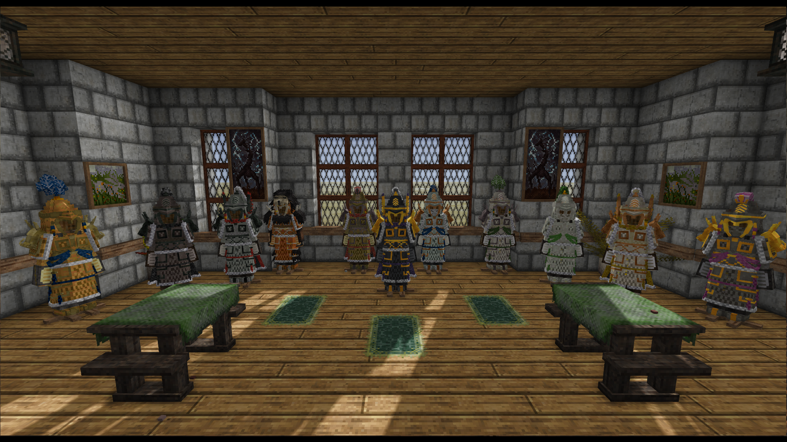</a></section>
<section class="dynasties-intro-set" aria-labelledby="jin-set-title"><h3 id="jin-set-title">Scale set Jin</h3>
<a class="dynasties-image dynasties-wideshot" href="images/introduction/jinscaleset.png" aria-label="Open Scale set Jin preview">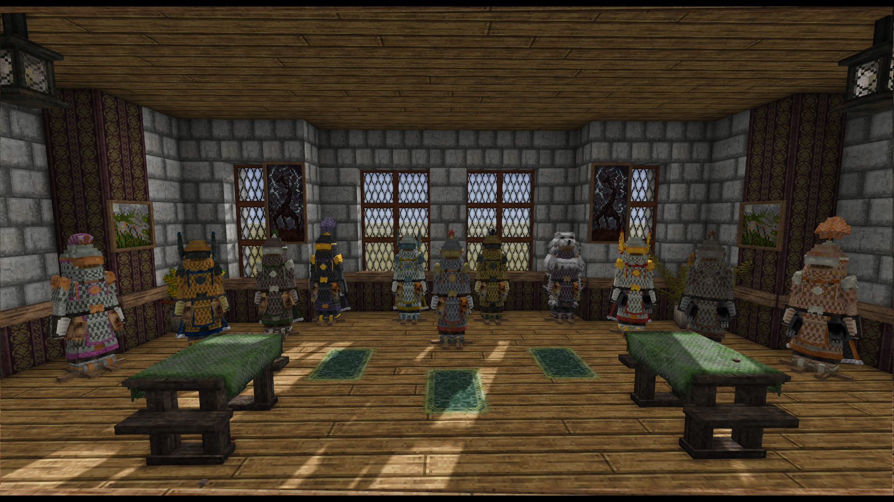</a></section>
<section class="dynasties-intro-set" aria-labelledby="qing-set-title"><h3 id="qing-set-title">Brigandine set Qing</h3>
<a class="dynasties-image dynasties-wideshot" href="images/introduction/qingbrigandineset.png" aria-label="Open Brigandine set Qing preview">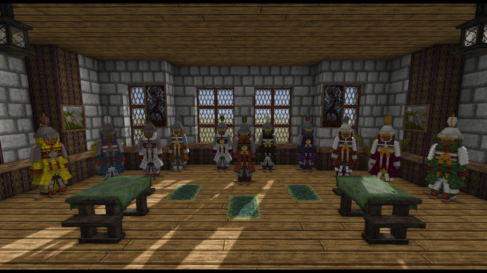</a></section>
</section>
  <!-- Scale Song helmet: Animal variants follow the other decorations. -->
<section id="song-helmet" class="dynasties-section" aria-labelledby="song-helmet-title"><h2 id="song-helmet-title">Scale Song helmet decorations</h2>
<section class="dynasties-decoration-group" aria-labelledby="song-helmet-communis-title"><h3 id="song-helmet-communis-title">Communis</h3>

<figure class="dynasties-card">
  <a class="dynasties-image" href="images/song-helmet/communis/pennae.png" aria-label="Open Pennae image">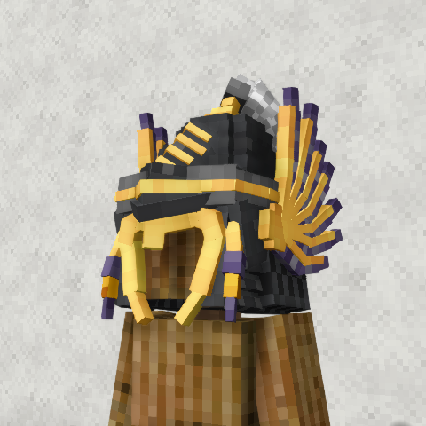</a>
  <figcaption>Communis-Pennae</figcaption>
</figure>
<figure class="dynasties-card">
  <a class="dynasties-image" href="images/song-helmet/communis/pluma.png" aria-label="Open Pluma image">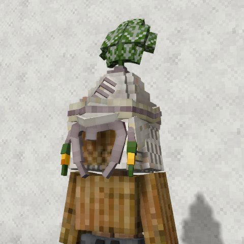</a>
  <figcaption>Communis-Pluma</figcaption>
</figure>
<figure class="dynasties-card">
  <a class="dynasties-image" href="images/song-helmet/communis/crista.png" aria-label="Open Crista image">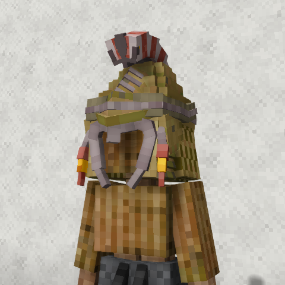</a>
  <figcaption>Communis-Crista</figcaption>
</figure>
<figure class="dynasties-card">
  <a class="dynasties-image" href="images/song-helmet/communis/pinna.png" aria-label="Open Pinna image">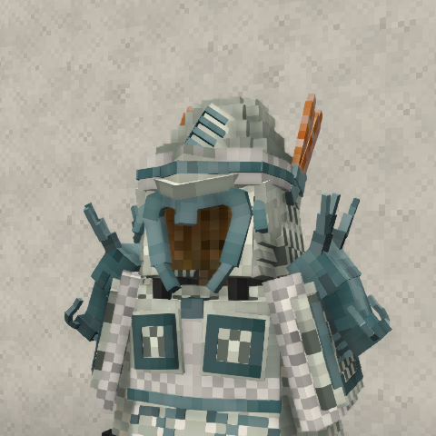</a>
  <figcaption>Communis-Pinna</figcaption>
</figure>
<figure class="dynasties-card">
  
  <figcaption>Communis-Sertum</figcaption>
</figure>
<figure class="dynasties-card">
  
  <figcaption>Communis-Transersa</figcaption>
</figure>
<figure class="dynasties-card">
  
  <figcaption>Communis-Vexillum</figcaption>
</figure>

</section>
<section class="dynasties-decoration-group" aria-labelledby="song-helmet-regalis-title"><h3 id="song-helmet-regalis-title">Regalis</h3>

<figure class="dynasties-card">
  <a class="dynasties-image" href="images/song-helmet/regalis/crista.png" aria-label="Open Crista image">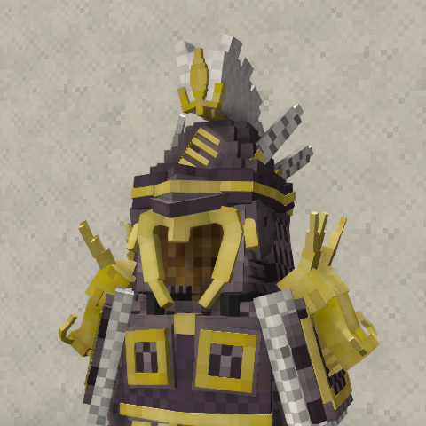</a>
  <figcaption>Regalis-Crista</figcaption>
</figure>
<figure class="dynasties-card">
  
  <figcaption>Regalis-Transversa</figcaption>
</figure>
<figure class="dynasties-card">
  
  <figcaption>Regalis-Pennae</figcaption>
</figure>
<figure class="dynasties-card">
  
  <figcaption>Regalis-Pinna</figcaption>
</figure>
<figure class="dynasties-card">
  
  <figcaption>Regalis-Pluma</figcaption>
</figure>
<figure class="dynasties-card">
  
  <figcaption>Regalis-Sertum</figcaption>
</figure>
<figure class="dynasties-card">
  
  <figcaption>Regalis-Vexillum</figcaption>
</figure>

</section>
<section class="dynasties-decoration-group" aria-labelledby="song-helmet-metallicus-title"><h3 id="song-helmet-metallicus-title">Metallicus</h3>

<figure class="dynasties-card">
  <a class="dynasties-image" href="images/song-helmet/metallicus/laurea.png" aria-label="Open Laurea image">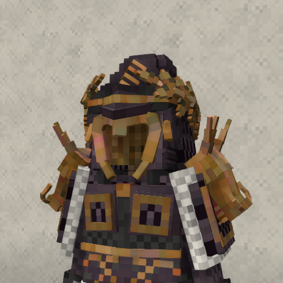</a>
  <figcaption>Metallicus-Laurea</figcaption>
</figure>
<figure class="dynasties-card">
  
  <figcaption>Metallicus-Corona</figcaption>
</figure>
<figure class="dynasties-card">
  
  <figcaption>Metallicus-Cervinus</figcaption>
</figure>
<figure class="dynasties-card">
  
  <figcaption>Metallicus-Arietinus</figcaption>
</figure>
<figure class="dynasties-card">
  
  <figcaption>Metallicus-Taurinus</figcaption>
</figure>

</section>
<section class="dynasties-decoration-group" aria-labelledby="song-helmet-animal-title"><h3 id="song-helmet-animal-title">Animal</h3>

<figure class="dynasties-card">
  <a class="dynasties-image" href="images/song-helmet/animal/bear.png" aria-label="Open Bear image">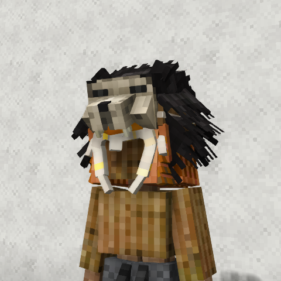</a>
  <figcaption>Bear</figcaption>
</figure>
<figure class="dynasties-card">
  <a class="dynasties-image" href="images/song-helmet/animal/wolf.png" aria-label="Open Wolf image">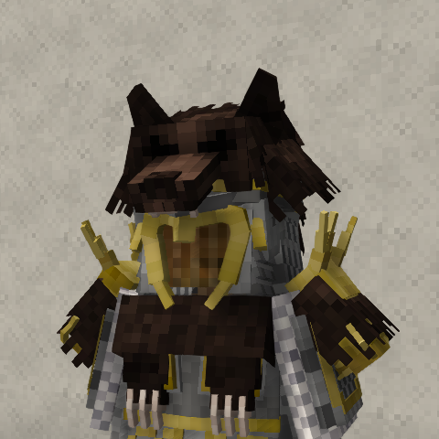</a>
  <figcaption>Wolf</figcaption>
</figure>

</section>
</section>
  <!-- Scale Song masked helmet: Animal variants follow the other decorations. -->
<section id="song-masked-helmet" class="dynasties-section" aria-labelledby="song-masked-helmet-title"><h2 id="song-masked-helmet-title">Scale Song masked helmet decorations</h2>
<section class="dynasties-decoration-group" aria-labelledby="song-masked-helmet-communis-title"><h3 id="song-masked-helmet-communis-title">Communis</h3>

<figure class="dynasties-card">
  <a class="dynasties-image" href="images/song-masked-helmet/communis/pennae.png" aria-label="Open Pennae image">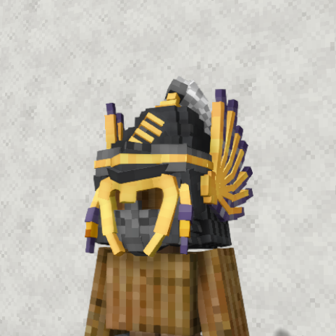</a>
  <figcaption>Communis-Pennae</figcaption>
</figure>
<figure class="dynasties-card">
  <a class="dynasties-image" href="images/song-masked-helmet/communis/pluma.png" aria-label="Open Pluma image">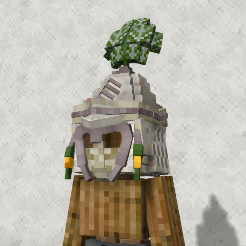</a>
  <figcaption>Communis-Pluma</figcaption>
</figure>
<figure class="dynasties-card">
  <a class="dynasties-image" href="images/song-masked-helmet/communis/crista.png" aria-label="Open Crista image">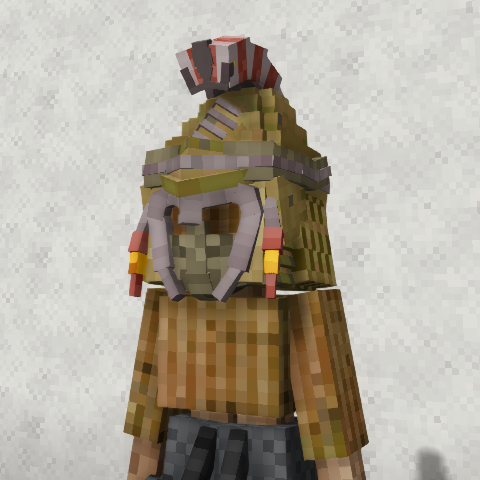</a>
  <figcaption>Communis-Crista</figcaption>
</figure>
<figure class="dynasties-card">
  <a class="dynasties-image" href="images/song-masked-helmet/communis/pinna.png" aria-label="Open Pinna image">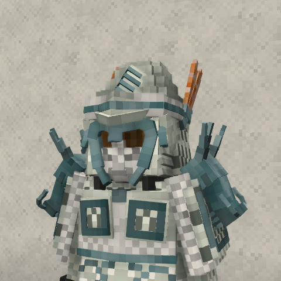</a>
  <figcaption>Communis-Pinna</figcaption>
</figure>
<figure class="dynasties-card">
  
  <figcaption>Communis-Sertum</figcaption>
</figure>
<figure class="dynasties-card">
  
  <figcaption>Communis-Transersa</figcaption>
</figure>
<figure class="dynasties-card">
  
  <figcaption>Communis-Vexillum</figcaption>
</figure>

</section>
<section class="dynasties-decoration-group" aria-labelledby="song-masked-helmet-regalis-title"><h3 id="song-masked-helmet-regalis-title">Regalis</h3>

<figure class="dynasties-card">
  <a class="dynasties-image" href="images/song-masked-helmet/regalis/crista.png" aria-label="Open Crista image">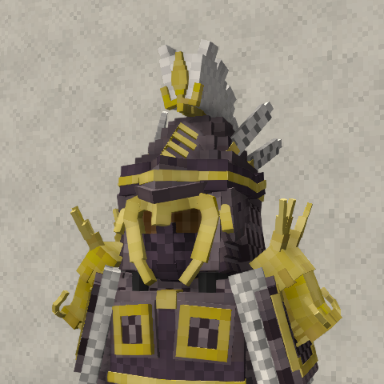</a>
  <figcaption>Regalis-Crista</figcaption>
</figure>
<figure class="dynasties-card">
  
  <figcaption>Regalis-Transversa</figcaption>
</figure>
<figure class="dynasties-card">
  
  <figcaption>Regalis-Pennae</figcaption>
</figure>
<figure class="dynasties-card">
  
  <figcaption>Regalis-Pinna</figcaption>
</figure>
<figure class="dynasties-card">
  
  <figcaption>Regalis-Pluma</figcaption>
</figure>
<figure class="dynasties-card">
  
  <figcaption>Regalis-Sertum</figcaption>
</figure>
<figure class="dynasties-card">
  
  <figcaption>Regalis-Vexillum</figcaption>
</figure>

</section>
<section class="dynasties-decoration-group" aria-labelledby="song-masked-helmet-metallicus-title"><h3 id="song-masked-helmet-metallicus-title">Metallicus</h3>

<figure class="dynasties-card">
  <a class="dynasties-image" href="images/song-masked-helmet/metallicus/laurea.png" aria-label="Open Laurea image">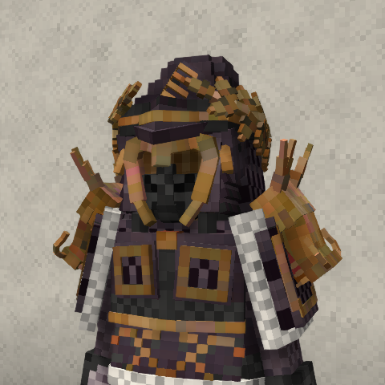</a>
  <figcaption>Metallicus-Laurea</figcaption>
</figure>
<figure class="dynasties-card">
  
  <figcaption>Metallicus-Corona</figcaption>
</figure>
<figure class="dynasties-card">
  
  <figcaption>Metallicus-Cervinus</figcaption>
</figure>
<figure class="dynasties-card">
  
  <figcaption>Metallicus-Arietinus</figcaption>
</figure>
<figure class="dynasties-card">
  
  <figcaption>Metallicus-Taurinus</figcaption>
</figure>

</section>
<section class="dynasties-decoration-group" aria-labelledby="song-masked-helmet-animal-title"><h3 id="song-masked-helmet-animal-title">Animal</h3>

<figure class="dynasties-card">
  <a class="dynasties-image" href="images/song-masked-helmet/animal/bear.png" aria-label="Open Bear image">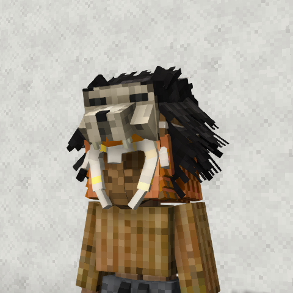</a>
  <figcaption>Bear</figcaption>
</figure>
<figure class="dynasties-card">
  <a class="dynasties-image" href="images/song-masked-helmet/animal/wolf.png" aria-label="Open Wolf image">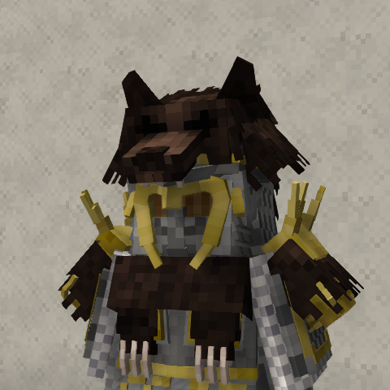</a>
  <figcaption>Wolf</figcaption>
</figure>

</section>
</section>
  <!-- Scale Jin helmet: Animal variants follow the other decorations. -->
<section id="jin-helmet" class="dynasties-section" aria-labelledby="jin-helmet-title"><h2 id="jin-helmet-title">Scale Jin helmet decorations</h2>
<section class="dynasties-decoration-group" aria-labelledby="jin-helmet-communis-title"><h3 id="jin-helmet-communis-title">Communis</h3>

<figure class="dynasties-card">
  <a class="dynasties-image" href="images/jin-helmet/communis/pennae.png" aria-label="Open Pennae image">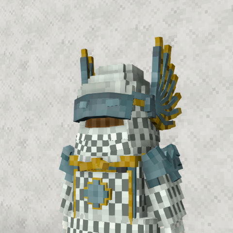</a>
  <figcaption>Communis-Pennae</figcaption>
</figure>
<figure class="dynasties-card">
  <a class="dynasties-image" href="images/jin-helmet/communis/pluma.png" aria-label="Open Pluma image">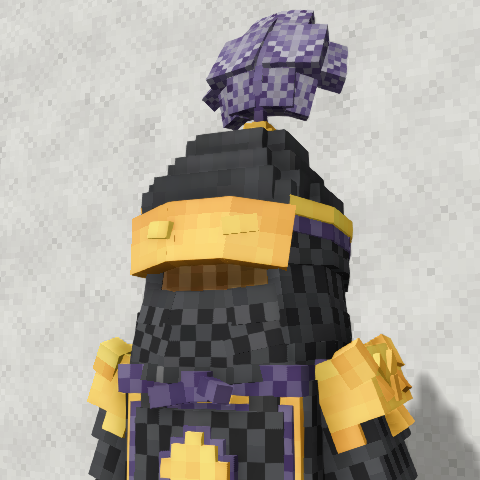</a>
  <figcaption>Communis-Pluma</figcaption>
</figure>
<figure class="dynasties-card">
  <a class="dynasties-image" href="images/jin-helmet/communis/crista.png" aria-label="Open Crista image">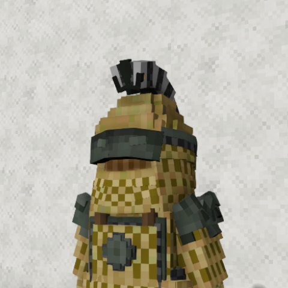</a>
  <figcaption>Communis-Crista</figcaption>
</figure>
<figure class="dynasties-card">
  <a class="dynasties-image" href="images/jin-helmet/communis/pinna.png" aria-label="Open Pinna image">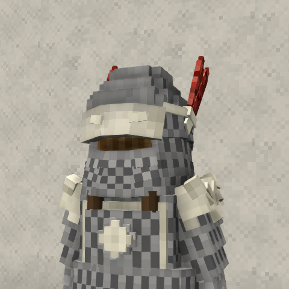</a>
  <figcaption>Communis-Pinna</figcaption>
</figure>
<figure class="dynasties-card">
  
  <figcaption>Communis-Sertum</figcaption>
</figure>
<figure class="dynasties-card">
  
  <figcaption>Communis-Transersa</figcaption>
</figure>
<figure class="dynasties-card">
  
  <figcaption>Communis-Vexillum</figcaption>
</figure>

</section>
<section class="dynasties-decoration-group" aria-labelledby="jin-helmet-regalis-title"><h3 id="jin-helmet-regalis-title">Regalis</h3>

<figure class="dynasties-card">
  <a class="dynasties-image" href="images/jin-helmet/regalis/crista.png" aria-label="Open Crista image">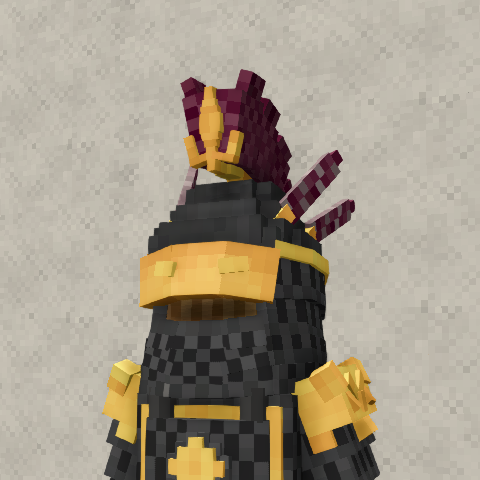</a>
  <figcaption>Regalis-Crista</figcaption>
</figure>
<figure class="dynasties-card">
  
  <figcaption>Regalis-Transversa</figcaption>
</figure>
<figure class="dynasties-card">
  
  <figcaption>Regalis-Pennae</figcaption>
</figure>
<figure class="dynasties-card">
  
  <figcaption>Regalis-Pinna</figcaption>
</figure>
<figure class="dynasties-card">
  
  <figcaption>Regalis-Pluma</figcaption>
</figure>
<figure class="dynasties-card">
  
  <figcaption>Regalis-Sertum</figcaption>
</figure>
<figure class="dynasties-card">
  
  <figcaption>Regalis-Vexillum</figcaption>
</figure>

</section>
<section class="dynasties-decoration-group" aria-labelledby="jin-helmet-metallicus-title"><h3 id="jin-helmet-metallicus-title">Metallicus</h3>

<figure class="dynasties-card">
  <a class="dynasties-image" href="images/jin-helmet/metallicus/laurea.png" aria-label="Open Laurea image">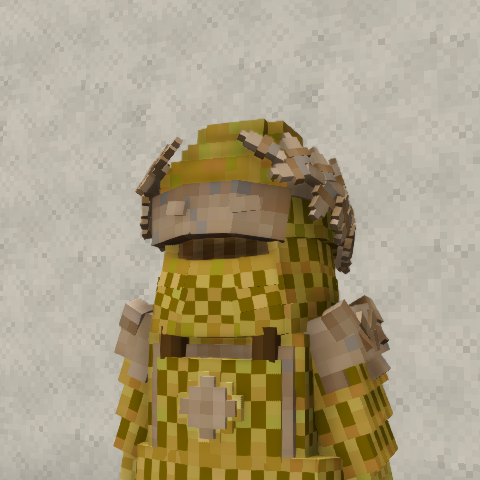</a>
  <figcaption>Metallicus-Laurea</figcaption>
</figure>
<figure class="dynasties-card">
  
  <figcaption>Metallicus-Corona</figcaption>
</figure>
<figure class="dynasties-card">
  
  <figcaption>Metallicus-Cervinus</figcaption>
</figure>
<figure class="dynasties-card">
  
  <figcaption>Metallicus-Arietinus</figcaption>
</figure>
<figure class="dynasties-card">
  
  <figcaption>Metallicus-Taurinus</figcaption>
</figure>

</section>
<section class="dynasties-decoration-group" aria-labelledby="jin-helmet-animal-title"><h3 id="jin-helmet-animal-title">Animal</h3>

<figure class="dynasties-card">
  <a class="dynasties-image" href="images/jin-helmet/animal/bear.png" aria-label="Open Bear image">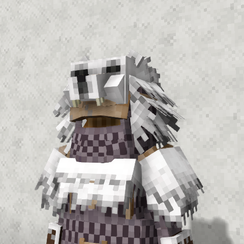</a>
  <figcaption>Bear</figcaption>
</figure>
<figure class="dynasties-card">
  <a class="dynasties-image" href="images/jin-helmet/animal/wolf.png" aria-label="Open Wolf image">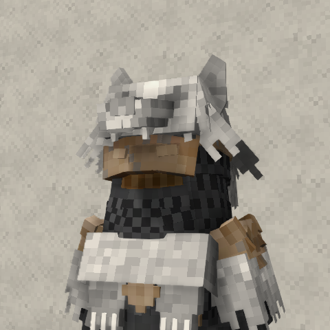</a>
  <figcaption>Wolf</figcaption>
</figure>

</section>
</section>
  <!-- Brigandine Qing helmet: Plain and Colored only. -->
<section id="qing-helmet" class="dynasties-section" aria-labelledby="qing-helmet-title"><h2 id="qing-helmet-title">Brigandine Qing helmet decorations</h2>

<figure class="dynasties-card">
  <a class="dynasties-image" href="images/qing-helmet/plain.png" aria-label="Open Plain image">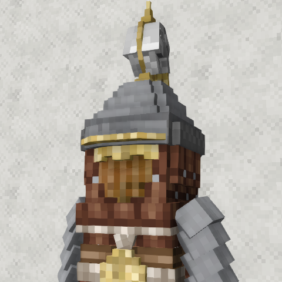</a>
  <figcaption>Plain</figcaption>
</figure>
<figure class="dynasties-card">
  <a class="dynasties-image" href="images/qing-helmet/colored.png" aria-label="Open Colored image">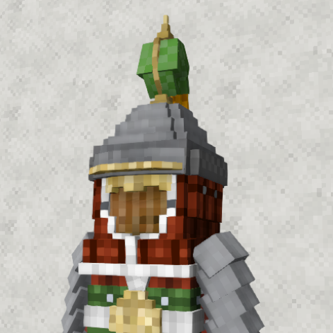</a>
  <figcaption>Colored</figcaption>
</figure>

</section>
  <!-- Scale Song Chestplate: Animal variants follow the other decorations. -->
<section id="song-chestplate" class="dynasties-section" aria-labelledby="song-chestplate-title"><h2 id="song-chestplate-title">Scale Song Chestplate decorations</h2>
<section class="dynasties-decoration-group" aria-labelledby="song-chestplate-brackets-title"><h3 id="song-chestplate-brackets-title">Brackets</h3>

<figure class="dynasties-card">
  <a class="dynasties-image" href="images/song-chestplate/brackets/insignia.png" aria-label="Open Insignia image">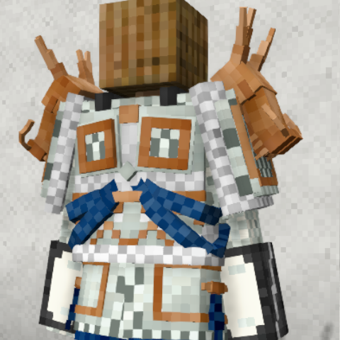</a>
  <figcaption>Insignia</figcaption>
</figure>
<figure class="dynasties-card">
  
  <figcaption>Pectorale</figcaption>
</figure>
<figure class="dynasties-card">
  
  <figcaption>Cingulum</figcaption>
</figure>
<figure class="dynasties-card">
  <a class="dynasties-image" href="images/song-chestplate/brackets/mantellum.png" aria-label="Open Mantellum image">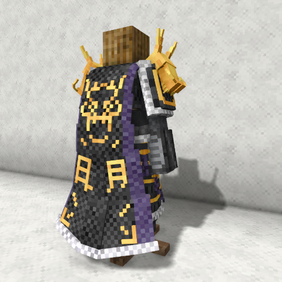</a>
  <figcaption>Mantellum</figcaption>
</figure>
<figure class="dynasties-card">
  
  <figcaption>Vexilium</figcaption>
</figure>
<figure class="dynasties-card">
  
  <figcaption>Balterus</figcaption>
</figure>

</section>
<section class="dynasties-decoration-group" aria-labelledby="song-chestplate-animal-title"><h3 id="song-chestplate-animal-title">Animal</h3>

<figure class="dynasties-card">
  <a class="dynasties-image" href="images/song-chestplate/animal/bear.png" aria-label="Open Bear image">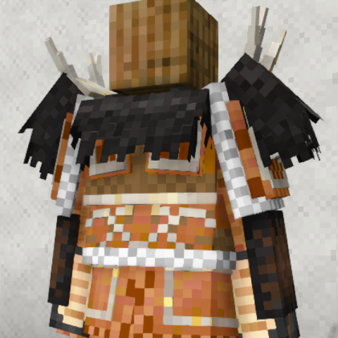</a>
  <figcaption>Bear</figcaption>
</figure>
<figure class="dynasties-card">
  <a class="dynasties-image" href="images/song-chestplate/animal/wolf.png" aria-label="Open Wolf image">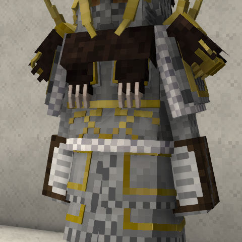</a>
  <figcaption>Wolf</figcaption>
</figure>

</section>
</section>
  <!-- Scale Jin Chestplate: Animal variants follow the other decorations. -->
<section id="jin-chestplate" class="dynasties-section" aria-labelledby="jin-chestplate-title"><h2 id="jin-chestplate-title">Scale Jin Chestplate decorations</h2>
<section class="dynasties-decoration-group" aria-labelledby="jin-chestplate-brackets-title"><h3 id="jin-chestplate-brackets-title">Brackets</h3>

<figure class="dynasties-card">
  <a class="dynasties-image" href="images/jin-chestplate/brackets/insignia.png" aria-label="Open Insignia image">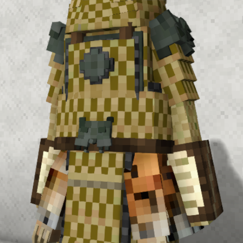</a>
  <figcaption>Insignia</figcaption>
</figure>
<figure class="dynasties-card">
  
  <figcaption>Pectorale</figcaption>
</figure>
<figure class="dynasties-card">
  
  <figcaption>Cingulum</figcaption>
</figure>
<figure class="dynasties-card">
  <a class="dynasties-image" href="images/jin-chestplate/brackets/mantellum.png" aria-label="Open Mantellum image">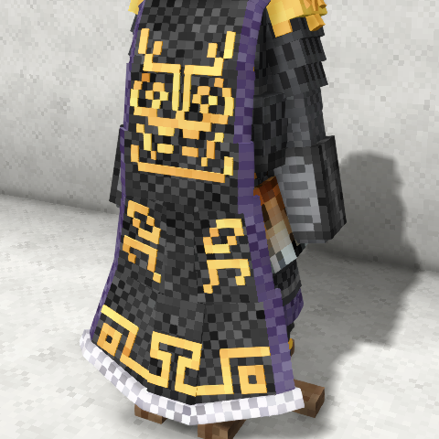</a>
  <figcaption>Mantellum</figcaption>
</figure>
<figure class="dynasties-card">
  
  <figcaption>Vexilium</figcaption>
</figure>
<figure class="dynasties-card">
  
  <figcaption>Balterus</figcaption>
</figure>

</section>
<section class="dynasties-decoration-group" aria-labelledby="jin-chestplate-animal-title"><h3 id="jin-chestplate-animal-title">Animal</h3>

<figure class="dynasties-card">
  <a class="dynasties-image" href="images/jin-chestplate/animal/bear.png" aria-label="Open Bear image">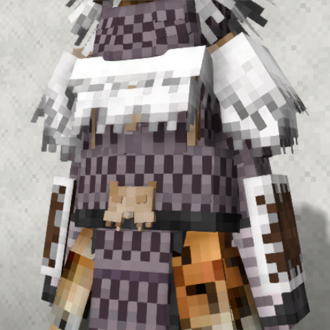</a>
  <figcaption>Bear</figcaption>
</figure>
<figure class="dynasties-card">
  <a class="dynasties-image" href="images/jin-chestplate/animal/wolf.png" aria-label="Open Wolf image">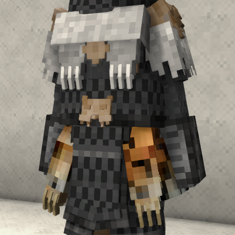</a>
  <figcaption>Wolf</figcaption>
</figure>

</section>
</section>
  <!-- Brigandine Qing Chestplate: Plain and Colored only. -->
<section id="qing-chestplate" class="dynasties-section" aria-labelledby="qing-chestplate-title"><h2 id="qing-chestplate-title">Brigandine Qing Chestplate decorations</h2>

<figure class="dynasties-card">
  <a class="dynasties-image" href="images/qing-chestplate/plain.png" aria-label="Open Plain image">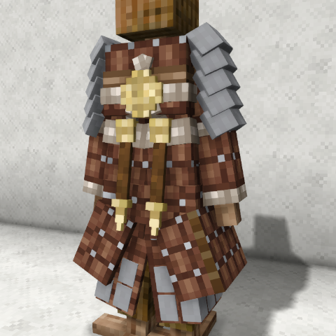</a>
  <figcaption>Plain</figcaption>
</figure>
<figure class="dynasties-card">
  <a class="dynasties-image" href="images/qing-chestplate/colored.png" aria-label="Open Colored image">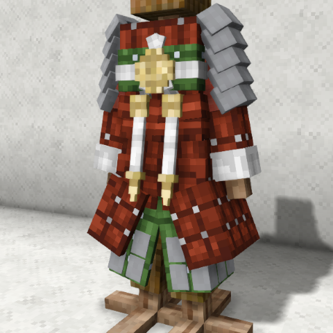</a>
  <figcaption>Colored</figcaption>
</figure>

</section>
  <!-- Scale Song Legplate: Animal variants follow the other decorations. -->
<section id="song-legplate" class="dynasties-section" aria-labelledby="song-legplate-title"><h2 id="song-legplate-title">Scale Song Legplate decorations</h2>

<figure class="dynasties-card">
  <a class="dynasties-image" href="images/song-legplate/lacinia.png" aria-label="Open Lacinia image">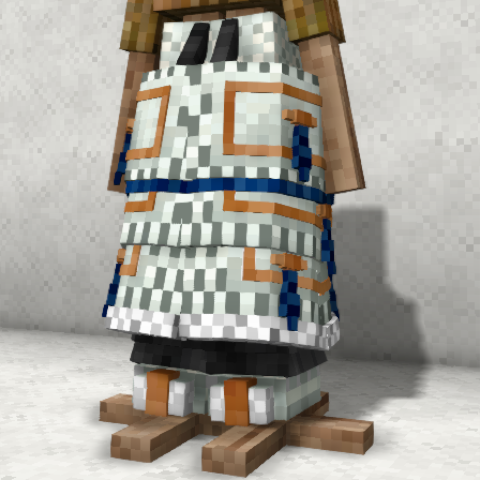</a>
  <figcaption>Lacinia</figcaption>
</figure>
<figure class="dynasties-card">
  
  <figcaption>Genuale</figcaption>
</figure>
<figure class="dynasties-card">
  
  <figcaption>Falda</figcaption>
</figure>

<section class="dynasties-decoration-group" aria-labelledby="song-legplate-animal-title"><h3 id="song-legplate-animal-title">Animal</h3>

<figure class="dynasties-card">
  <a class="dynasties-image" href="images/song-legplate/animal/bear.png" aria-label="Open Bear image">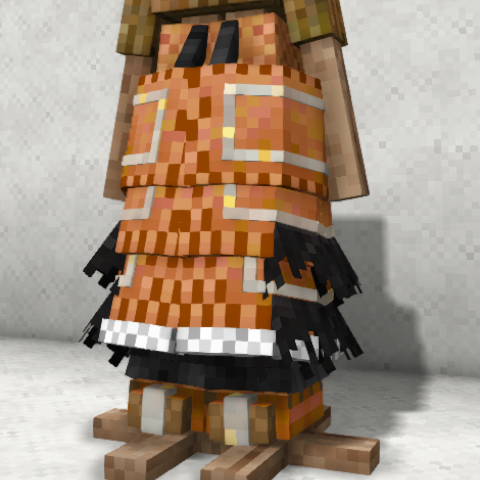</a>
  <figcaption>Bear</figcaption>
</figure>
<figure class="dynasties-card">
  <a class="dynasties-image" href="images/song-legplate/animal/wolf.png" aria-label="Open Wolf image">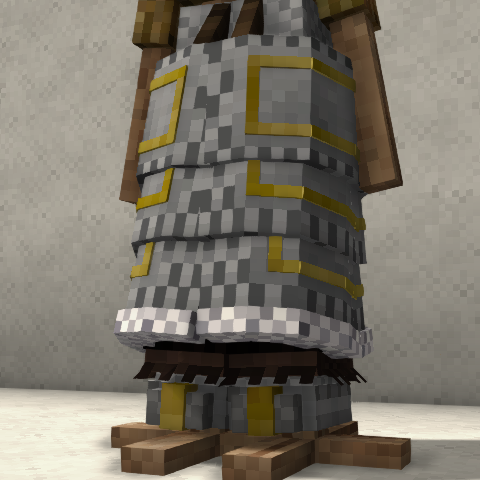</a>
  <figcaption>Wolf</figcaption>
</figure>

</section>
</section>
  <!-- Scale Jin Legplate: Animal variants follow the other decorations. -->
<section id="jin-legplate" class="dynasties-section" aria-labelledby="jin-legplate-title"><h2 id="jin-legplate-title">Scale Jin Legplate decorations</h2>

<figure class="dynasties-card">
  <a class="dynasties-image" href="images/jin-legplate/lacinia.png" aria-label="Open Lacinia image">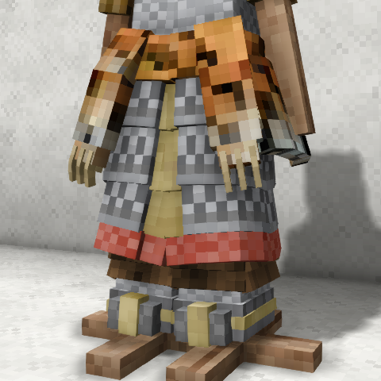</a>
  <figcaption>Lacinia</figcaption>
</figure>
<figure class="dynasties-card">
  
  <figcaption>Genuale</figcaption>
</figure>
<figure class="dynasties-card">
  
  <figcaption>Falda</figcaption>
</figure>

<section class="dynasties-decoration-group" aria-labelledby="jin-legplate-animal-title"><h3 id="jin-legplate-animal-title">Animal</h3>

<figure class="dynasties-card">
  <a class="dynasties-image" href="images/jin-legplate/animal/bear.png" aria-label="Open Bear image">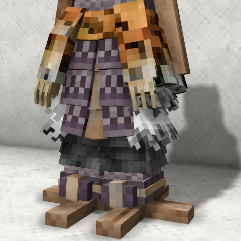</a>
  <figcaption>Bear</figcaption>
</figure>
<figure class="dynasties-card">
  <a class="dynasties-image" href="images/jin-legplate/animal/wolf.png" aria-label="Open Wolf image">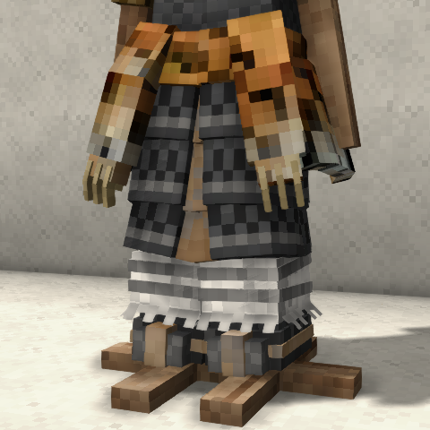</a>
  <figcaption>Wolf</figcaption>
</figure>

</section>
</section>
  <!-- Brigandine Qing Legplate: Plain and Colored only. -->
<section id="qing-legplate" class="dynasties-section" aria-labelledby="qing-legplate-title"><h2 id="qing-legplate-title">Brigandine Qing Legplate decorations</h2>

<figure class="dynasties-card">
  <a class="dynasties-image" href="images/qing-legplate/plain.png" aria-label="Open Plain image">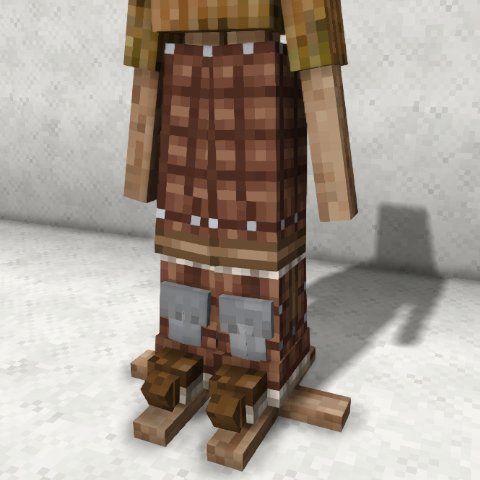</a>
  <figcaption>Plain</figcaption>
</figure>
<figure class="dynasties-card">
  <a class="dynasties-image" href="images/qing-legplate/colored.png" aria-label="Open Colored image">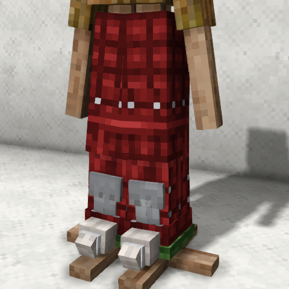</a>
  <figcaption>Colored</figcaption>
</figure>

</section>
<!-- Each set has its own row; metals appear side by side on desktop. -->
<section id="poses" class="dynasties-category" aria-labelledby="poses-title"><h2 id="poses-title">Poses</h2>
<section id="song-poses" class="dynasties-pose-row" aria-labelledby="song-poses-title"><h3 id="song-poses-title">Scale set Song</h3>

<section class="dynasties-section dynasties-pose-section" aria-labelledby="song-iron-poses-title"><h4 id="song-iron-poses-title">Song Iron poses</h4>

<figure class="dynasties-card">
  <a class="dynasties-image" href="images/poses/song/iron/songironpose1.png" aria-label="Open Song Iron — pose 1 image">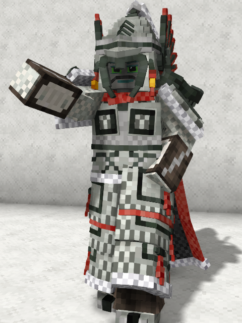</a>
  <figcaption>Song Iron — Pose 1</figcaption>
</figure>
<figure class="dynasties-card">
  <a class="dynasties-image" href="images/poses/song/iron/songironpose2.png" aria-label="Open Song Iron — pose 2 image">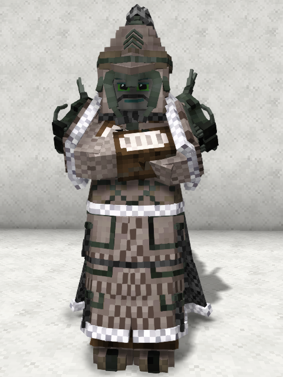</a>
  <figcaption>Song Iron — Pose 2</figcaption>
</figure>

</section>
<section class="dynasties-section dynasties-pose-section" aria-labelledby="song-meteoric-iron-poses-title"><h4 id="song-meteoric-iron-poses-title">Song Meteoric iron poses</h4>

<figure class="dynasties-card">
  <a class="dynasties-image" href="images/poses/song/meteoric-iron/songmeteoricironpose1.png" aria-label="Open Song Meteoric iron — pose 1 image">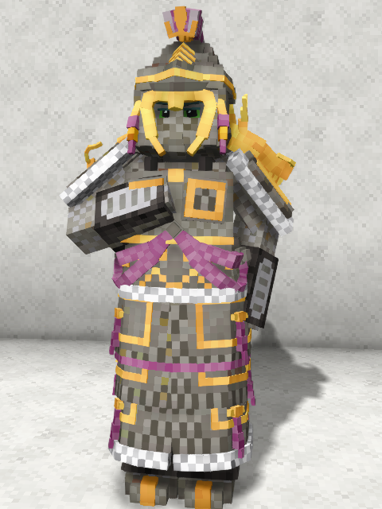</a>
  <figcaption>Song Meteoric Iron — Pose 1</figcaption>
</figure>
<figure class="dynasties-card">
  <a class="dynasties-image" href="images/poses/song/meteoric-iron/songmeteoricironpose2.png" aria-label="Open Song Meteoric iron — pose 2 image">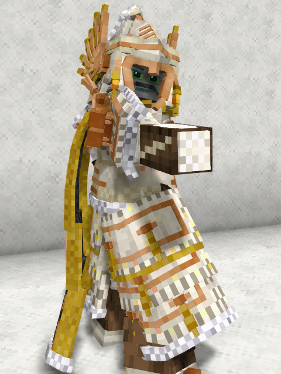</a>
  <figcaption>Song Meteoric Iron — Pose 2</figcaption>
</figure>

</section>
<section class="dynasties-section dynasties-pose-section" aria-labelledby="song-steel-poses-title"><h4 id="song-steel-poses-title">Song Steel poses</h4>

<figure class="dynasties-card">
  <a class="dynasties-image" href="images/poses/song/steel/songsteelpose1.png" aria-label="Open Song Steel — pose 1 image">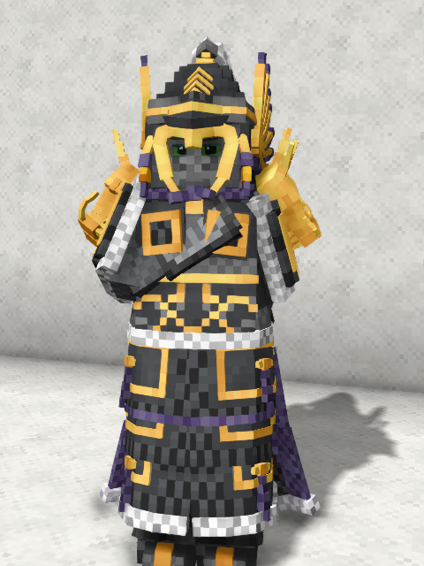</a>
  <figcaption>Song Steel — Pose 1</figcaption>
</figure>
<figure class="dynasties-card">
  <a class="dynasties-image" href="images/poses/song/steel/songsteelpose2.png" aria-label="Open Song Steel — pose 2 image">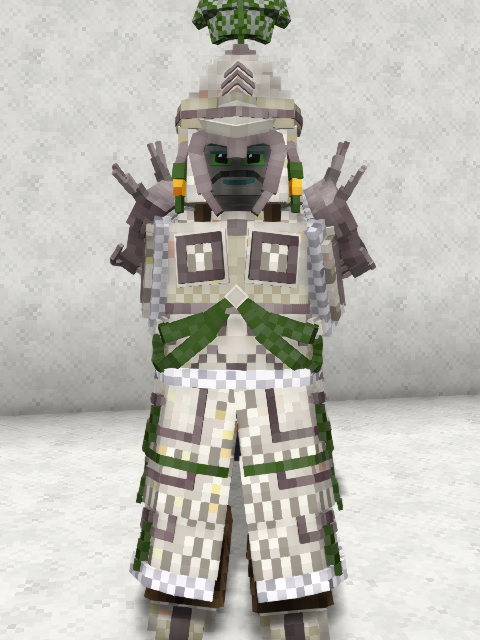</a>
  <figcaption>Song Steel — Pose 2</figcaption>
</figure>

</section>

</section>
<section id="jin-poses" class="dynasties-pose-row" aria-labelledby="jin-poses-title"><h3 id="jin-poses-title">Scale set Jin</h3>

<section class="dynasties-section dynasties-pose-section" aria-labelledby="jin-iron-poses-title"><h4 id="jin-iron-poses-title">Jin Iron poses</h4>

<figure class="dynasties-card">
  <a class="dynasties-image" href="images/poses/jin/iron/jinironpose1.png" aria-label="Open Jin Iron — pose 1 image">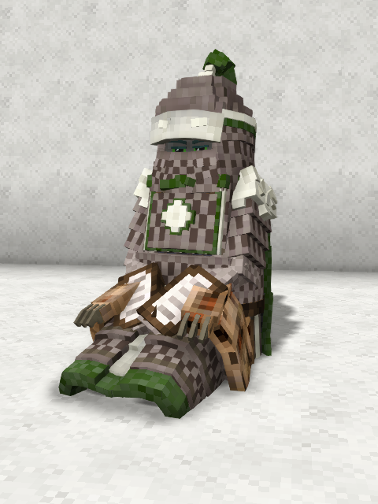</a>
  <figcaption>Jin Iron — Pose 1</figcaption>
</figure>
<figure class="dynasties-card">
  <a class="dynasties-image" href="images/poses/jin/iron/jinironpose2.png" aria-label="Open Jin Iron — pose 2 image">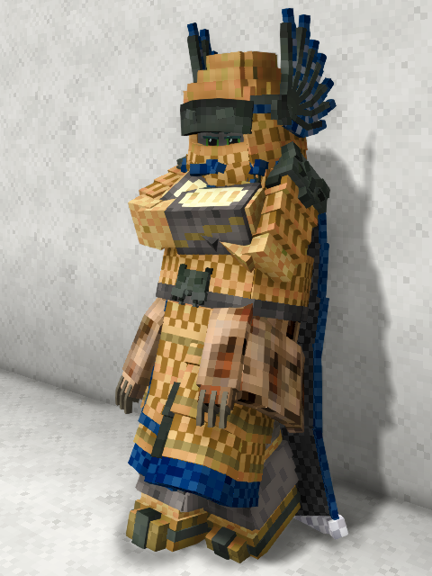</a>
  <figcaption>Jin Iron — Pose 2</figcaption>
</figure>

</section>
<section class="dynasties-section dynasties-pose-section" aria-labelledby="jin-meteoric-iron-poses-title"><h4 id="jin-meteoric-iron-poses-title">Jin Meteoric iron poses</h4>

<figure class="dynasties-card">
  <a class="dynasties-image" href="images/poses/jin/meteoric-iron/jinmeteoricironpose1.png" aria-label="Open Jin Meteoric iron — pose 1 image">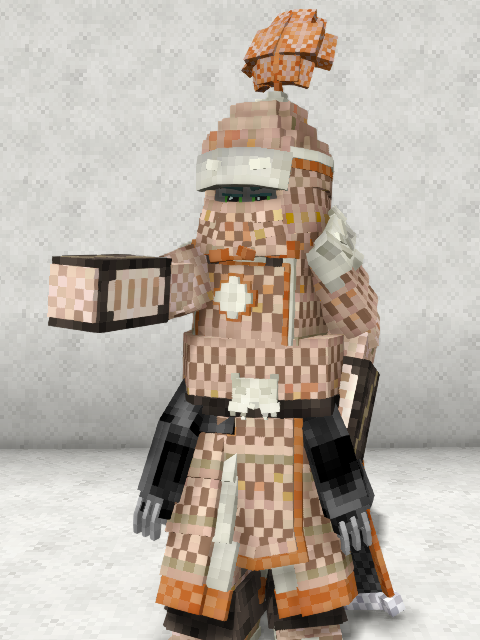</a>
  <figcaption>Jin Meteoric Iron — Pose 1</figcaption>
</figure>
<figure class="dynasties-card">
  <a class="dynasties-image" href="images/poses/jin/meteoric-iron/jinmeteoricironpose2.png" aria-label="Open Jin Meteoric iron — pose 2 image">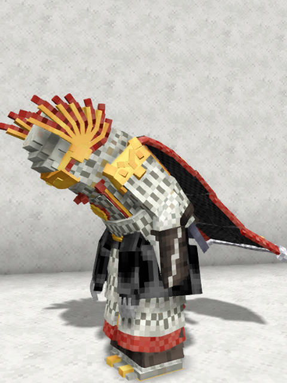</a>
  <figcaption>Jin Meteoric Iron — Pose 2</figcaption>
</figure>

</section>
<section class="dynasties-section dynasties-pose-section" aria-labelledby="jin-steel-poses-title"><h4 id="jin-steel-poses-title">Jin Steel poses</h4>

<figure class="dynasties-card">
  <a class="dynasties-image" href="images/poses/jin/steel/jinsteelpose1.png" aria-label="Open Jin Steel — pose 1 image">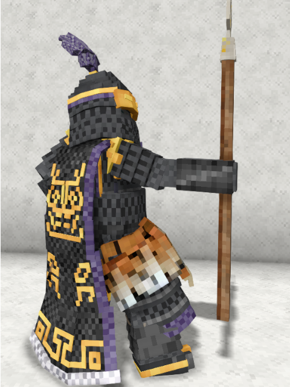</a>
  <figcaption>Jin Steel — Pose 1</figcaption>
</figure>
<figure class="dynasties-card">
  <a class="dynasties-image" href="images/poses/jin/steel/jinsteelpose2.png" aria-label="Open Jin Steel — pose 2 image">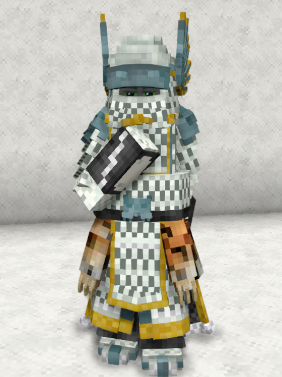</a>
  <figcaption>Jin Steel — Pose 2</figcaption>
</figure>

</section>

</section>
<section id="qing-poses" class="dynasties-pose-row" aria-labelledby="qing-poses-title"><h3 id="qing-poses-title">Brigandine set Qing</h3>

<section class="dynasties-section dynasties-pose-section" aria-labelledby="qing-iron-poses-title"><h4 id="qing-iron-poses-title">Qing Iron poses</h4>

<figure class="dynasties-card">
  <a class="dynasties-image" href="images/poses/qing/iron/qingironpose1.png" aria-label="Open Qing Iron — pose 1 image">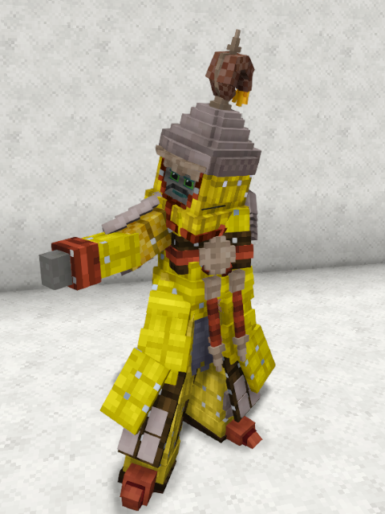</a>
  <figcaption>Qing Iron — Pose 1</figcaption>
</figure>
<figure class="dynasties-card">
  <a class="dynasties-image" href="images/poses/qing/iron/qingironpose2.png" aria-label="Open Qing Iron — pose 2 image">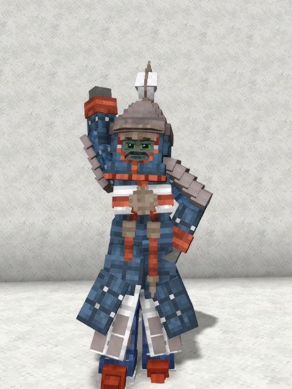</a>
  <figcaption>Qing Iron — Pose 2</figcaption>
</figure>

</section>
<section class="dynasties-section dynasties-pose-section" aria-labelledby="qing-meteoric-iron-poses-title"><h4 id="qing-meteoric-iron-poses-title">Qing Meteoric iron poses</h4>

<figure class="dynasties-card">
  <a class="dynasties-image" href="images/poses/qing/meteoric-iron/qingmeteoricironpose1.png" aria-label="Open Qing Meteoric iron — pose 1 image">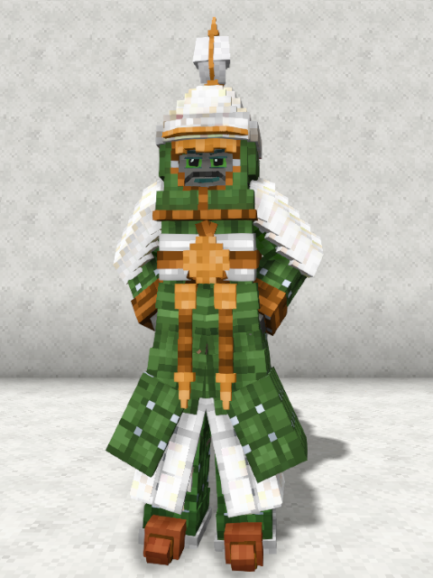</a>
  <figcaption>Qing Meteoric Iron — Pose 1</figcaption>
</figure>
<figure class="dynasties-card">
  <a class="dynasties-image" href="images/poses/qing/meteoric-iron/qingmeteoricironpose2.png" aria-label="Open Qing Meteoric iron — pose 2 image">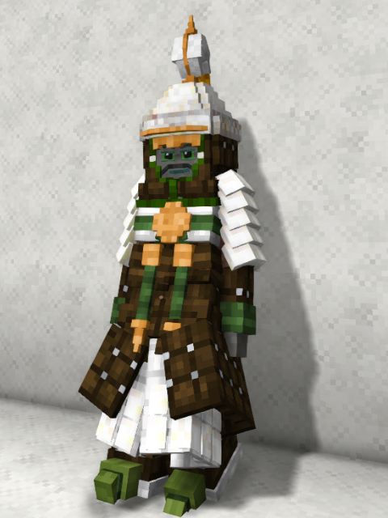</a>
  <figcaption>Qing Meteoric Iron — Pose 2</figcaption>
</figure>

</section>
<section class="dynasties-section dynasties-pose-section" aria-labelledby="qing-steel-poses-title"><h4 id="qing-steel-poses-title">Qing Steel poses</h4>

<figure class="dynasties-card">
  <a class="dynasties-image" href="images/poses/qing/steel/qingsteelpose1.png" aria-label="Open Qing Steel — pose 1 image">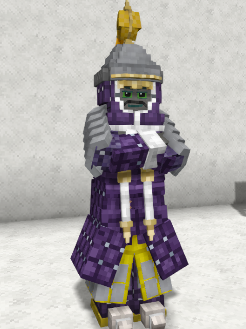</a>
  <figcaption>Qing Steel — Pose 1</figcaption>
</figure>
<figure class="dynasties-card">
  <a class="dynasties-image" href="images/poses/qing/steel/qingsteelpose2.png" aria-label="Open Qing Steel — pose 2 image">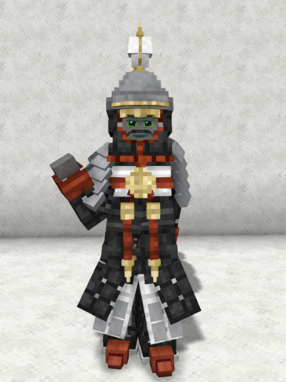</a>
  <figcaption>Qing Steel — Pose 2</figcaption>
</figure>

</section>

</section>
</section>

<a class="button" href="https://mods.vintagestory.at/show/user/922a98ad603bda6d92eb">All mods on ModDB ↗</a><a href="#main">↑ Back to top</a>

