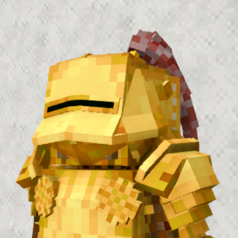
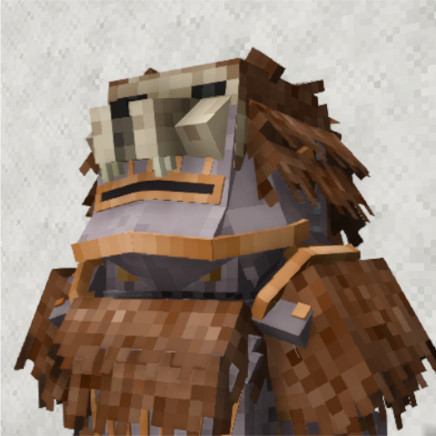
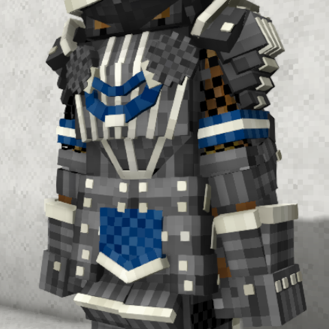

<link rel="stylesheet" href="{{ '/vintage-story/forgotten-armory/gothic/gothic.css' | relative_url }}">
<link rel="stylesheet" href="{{ '/vintage-story/forgotten-armory/gothic/gothic-decorations.css' | relative_url }}">

  <a href="{{ '/vintage-story/forgotten-armory/' | relative_url }}">← Back to the armory</a>

  <section class="hero gothic-hero">
    
FORGOTTEN ARMORY

    <h1>Gothic</h1>
    
The plate set, its decorations and material poses.

  </section>

  <nav class="gothic-navigation" aria-label="Gothic sections">
    <a href="#introduction">Introduction</a>
    <a href="#sallet">Sallet Helmet</a>
    <a href="#chestplate">Noble Chestplate</a>
    <a href="#legplate">Noble Legplate</a>
    <a href="#poses">Poses</a>
  </nav>

  <!-- Introduction: a temporary copy of the Greenwich wideshot is shown in full, without cropping. -->
  <section id="introduction" class="gothic-section" aria-labelledby="introduction-title">
    <h2 id="introduction-title">Introduction</h2>
    <section aria-labelledby="plate-set-title">
      <h3 id="plate-set-title">Plate set</h3>
      
    </section>
  </section>

  <!-- Sallet Helmet decorations -->
  <section id="sallet" class="gothic-section" aria-labelledby="sallet-title">
    <h2 id="sallet-title">Sallet Helmet decorations</h2>
    <section class="gothic-decoration-group" aria-labelledby="sallet-communis-title">
      <h3 id="sallet-communis-title">Communis</h3>
      

        <figure class="gothic-card">
          
          <figcaption>Communis-Pennae</figcaption>
        </figure>
        <figure class="gothic-card">
          
          <figcaption>Communis-Pluma</figcaption>
        </figure>
        <figure class="gothic-card">
          
          <figcaption>Communis-Crista</figcaption>
        </figure>
        <figure class="gothic-card">
          
          <figcaption>Communis-pinna</figcaption>
        </figure>
        <figure class="gothic-card">
          
          <figcaption>Communis-sertum</figcaption>
        </figure>
        <figure class="gothic-card">
          
          <figcaption>Communis-transersa</figcaption>
        </figure>
        <figure class="gothic-card">
          
          <figcaption>Communis-vexillum</figcaption>
        </figure>
      

    </section>
    <section class="gothic-decoration-group" aria-labelledby="sallet-regalis-title">
      <h3 id="sallet-regalis-title">Regalis</h3>
      

        <figure class="gothic-card">
          
          <figcaption>Regalis-crista</figcaption>
        </figure>
        <figure class="gothic-card">
          
          <figcaption>Regalis-transversa</figcaption>
        </figure>
        <figure class="gothic-card">
          
          <figcaption>Regalis-pennae</figcaption>
        </figure>
        <figure class="gothic-card">
          
          <figcaption>Regalis-pinna</figcaption>
        </figure>
        <figure class="gothic-card">
          
          <figcaption>Regalis-pluma</figcaption>
        </figure>
        <figure class="gothic-card">
          
          <figcaption>Regalis-sertum</figcaption>
        </figure>
        <figure class="gothic-card">
          
          <figcaption>Regalis-vexillum</figcaption>
        </figure>
      

    </section>
    <section class="gothic-decoration-group" aria-labelledby="sallet-metallicus-title">
      <h3 id="sallet-metallicus-title">Metallicus</h3>
      

        <figure class="gothic-card">
          
          <figcaption>Metallicus-laurea</figcaption>
        </figure>
        <figure class="gothic-card">
          
          <figcaption>Metallicus-corona</figcaption>
        </figure>
        <figure class="gothic-card">
          
          <figcaption>Metallicus-cervinus</figcaption>
        </figure>
        <figure class="gothic-card">
          
          <figcaption>Metallicus-arietinus</figcaption>
        </figure>
        <figure class="gothic-card">
          
          <figcaption>Metallicus-taurinus</figcaption>
        </figure>
      

    </section>
    <!-- Animal variants follow all other decorations for this armour part. -->
    <section class="gothic-decoration-group" aria-labelledby="sallet-animal-title">
      <h3 id="sallet-animal-title">Animal</h3>
      

        <figure class="gothic-card">
          
          <figcaption>bear</figcaption>
        </figure>
        <figure class="gothic-card">
          
          <figcaption>wolf</figcaption>
        </figure>
      

    </section>
  </section>

  <!-- Noble Chestplate decorations -->
  <section id="chestplate" class="gothic-section" aria-labelledby="chestplate-title">
    <h2 id="chestplate-title">Noble Chestplate decorations</h2>
    <section class="gothic-decoration-group" aria-labelledby="chestplate-brackets-title">
      <h3 id="chestplate-brackets-title">Brackets</h3>
      

        <figure class="gothic-card">
          
          <figcaption>Insignia</figcaption>
        </figure>
        <figure class="gothic-card">
          
          <figcaption>pectorale</figcaption>
        </figure>
        <figure class="gothic-card">
          
          <figcaption>cingulum</figcaption>
        </figure>
        <figure class="gothic-card">
          
          <figcaption>mantellum</figcaption>
        </figure>
        <figure class="gothic-card">
          
          <figcaption>vexilium</figcaption>
        </figure>
        <figure class="gothic-card">
          
          <figcaption>balterus</figcaption>
        </figure>
      

    </section>
    <!-- Animal variants follow all other decorations for this armour part. -->
    <section class="gothic-decoration-group" aria-labelledby="chestplate-animal-title">
      <h3 id="chestplate-animal-title">Animal</h3>
      

        <figure class="gothic-card">
          
          <figcaption>bear</figcaption>
        </figure>
        <figure class="gothic-card">
          
          <figcaption>wolf</figcaption>
        </figure>
      

    </section>
  </section>

  <!-- Noble Legplate decorations -->
  <section id="legplate" class="gothic-section" aria-labelledby="legplate-title">
    <h2 id="legplate-title">Noble Legplate decorations</h2>
      

        
        <figure class="gothic-card">
          
          <figcaption>Lacinia</figcaption>
        </figure>
        <figure class="gothic-card">
          
          <figcaption>genuale</figcaption>
        </figure>
        <figure class="gothic-card">
          
          <figcaption>falda</figcaption>
        </figure>
      

    <!-- Animal variants follow all other decorations for this armour part. -->
    <section class="gothic-decoration-group" aria-labelledby="legplate-animal-title">
      <h3 id="legplate-animal-title">Animal</h3>
      

        <figure class="gothic-card">
          
          <figcaption>bear</figcaption>
        </figure>
        <figure class="gothic-card">
          
          <figcaption>wolf</figcaption>
        </figure>
      

    </section>
  </section>

  <!-- Material poses: three equal columns on desktop; stacked on narrow screens. -->
  

    <section class="gothic-section gothic-pose-section" aria-labelledby="iron-title">
      <h2 id="iron-title">Iron poses</h2>
      

      <figure class="gothic-card">
        
        <figcaption>Iron — pose 1</figcaption>
      </figure>
      <figure class="gothic-card">
        
        <figcaption>Iron — pose 2</figcaption>
      </figure>
      

    </section>
    <section class="gothic-section gothic-pose-section" aria-labelledby="meteoric-iron-title">
      <h2 id="meteoric-iron-title">Meteoric iron poses</h2>
      

      <figure class="gothic-card">
        
        <figcaption>Meteoric iron — pose 1</figcaption>
      </figure>
      <figure class="gothic-card">
        
        <figcaption>Meteoric iron — pose 2</figcaption>
      </figure>
      

    </section>
    <section class="gothic-section gothic-pose-section" aria-labelledby="steel-title">
      <h2 id="steel-title">Steel poses</h2>
      

      <figure class="gothic-card">
        
        <figcaption>Steel — pose 1</figcaption>
      </figure>
      <figure class="gothic-card">
        
        <figcaption>Steel — pose 2</figcaption>
      </figure>
      

    </section>
  

  

    <a class="button" href="https://mods.vintagestory.at/show/user/922a98ad603bda6d92eb">All mods on ModDB ↗</a>
    <a href="#main">↑ Back to top</a>
  

