<link rel="stylesheet" href="{{ '/vintage-story/forgotten-armory/greenwich/greenwich.css' | relative_url }}">
<link rel="stylesheet" href="{{ '/vintage-story/forgotten-armory/greenwich/greenwich-decorations.css' | relative_url }}">

  <a href="{{ '/vintage-story/forgotten-armory/' | relative_url }}">← Back to the armory</a>

  <section class="hero greenwich-hero">
    
FORGOTTEN ARMORY

    <h1>Greenwich</h1>
    
The plate set, its decorations and material poses.

  </section>

  <nav class="greenwich-navigation" aria-label="Greenwich sections">
    <a href="#introduction">Introduction</a>
    <a href="#armet">Armet Helmet</a>
    <a href="#chestplate">Noble Chestplate</a>
    <a href="#legplate">Noble Legplate</a>
    <a href="#poses">Poses</a>
  </nav>

  <!-- Introduction: the original wideshot is shown in full, without cropping. -->
  <section id="introduction" class="greenwich-section" aria-labelledby="introduction-title">
    <h2 id="introduction-title">Introduction</h2>
    <section aria-labelledby="plate-set-title">
      <h3 id="plate-set-title">Plate set</h3>
      <a class="greenwich-image greenwich-wideshot" href="images/introduction/greenwich1.png" aria-label="Open Greenwich plate set wideshot">
        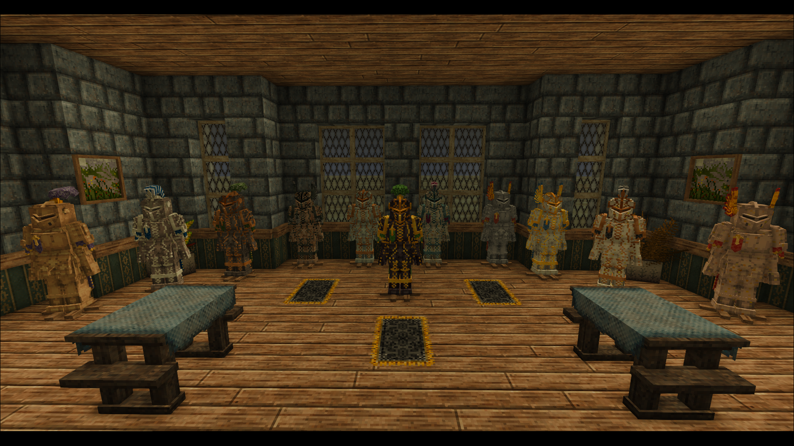
      </a>
    </section>
  </section>

  <!-- Armet Helmet decorations -->
  <section id="armet" class="greenwich-section" aria-labelledby="armet-title">
    <h2 id="armet-title">Armet Helmet decorations</h2>
    <section class="greenwich-decoration-group" aria-labelledby="armet-communis-title">
      <h3 id="armet-communis-title">Communis</h3>
      

        <figure class="greenwich-card">
          <a class="greenwich-image" href="images/armet/communis/pennae.png" aria-label="Open Communis-Pennae image">
            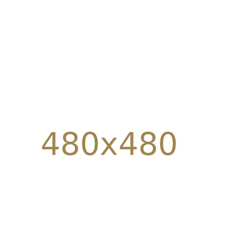
          </a>
          <figcaption>Communis-Pennae</figcaption>
        </figure>
        <figure class="greenwich-card">
          
          <figcaption>Communis-Pluma</figcaption>
        </figure>
        <figure class="greenwich-card">
          
          <figcaption>Communis-Crista</figcaption>
        </figure>
        <figure class="greenwich-card">
          <a class="greenwich-image" href="images/armet/communis/pinna.png" aria-label="Open Communis-pinna image">
            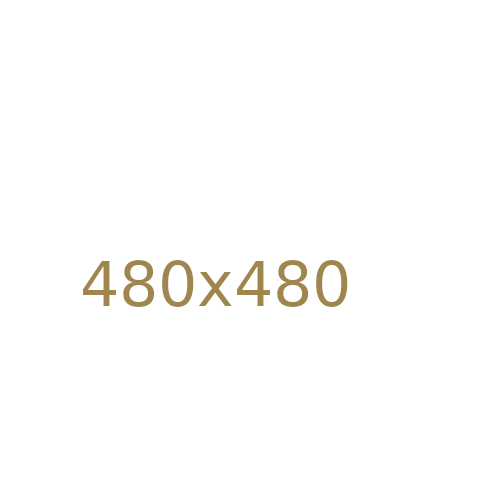
          </a>
          <figcaption>Communis-Pinna</figcaption>
        </figure>
        <figure class="greenwich-card">
          
          <figcaption>Communis-Sertum</figcaption>
        </figure>
        <figure class="greenwich-card">
          <a class="greenwich-image" href="images/armet/communis/transersa.png" aria-label="Open Communis-transersa image">
            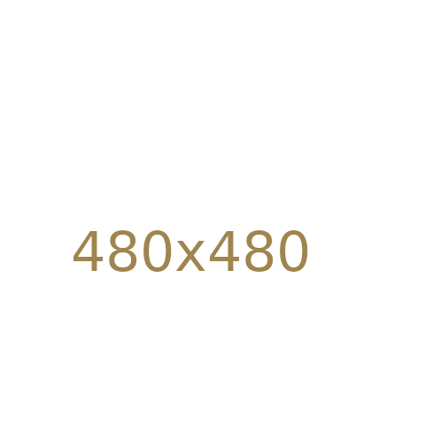
          </a>
          <figcaption>Communis-Transersa</figcaption>
        </figure>
        <figure class="greenwich-card">
          
          <figcaption>Communis-Vexillum</figcaption>
        </figure>
      

    </section>
    <section class="greenwich-decoration-group" aria-labelledby="armet-regalis-title">
      <h3 id="armet-regalis-title">Regalis</h3>
      

        <figure class="greenwich-card">
          <a class="greenwich-image" href="images/armet/regalis/crista.png" aria-label="Open Regalis-crista image">
            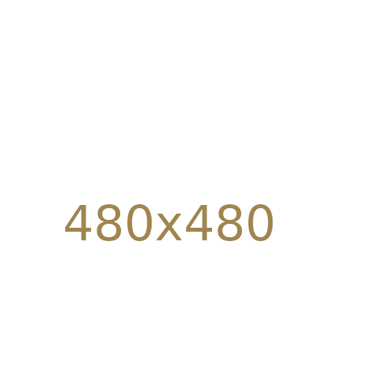
          </a>
          <figcaption>Regalis-Crista</figcaption>
        </figure>
        <figure class="greenwich-card">
          
          <figcaption>Regalis-Transversa</figcaption>
        </figure>
        <figure class="greenwich-card">
          
          <figcaption>Regalis-Pennae</figcaption>
        </figure>
        <figure class="greenwich-card">
          
          <figcaption>Regalis-Pinna</figcaption>
        </figure>
        <figure class="greenwich-card">
          
          <figcaption>Regalis-Pluma</figcaption>
        </figure>
        <figure class="greenwich-card">
          
          <figcaption>Regalis-Sertum</figcaption>
        </figure>
        <figure class="greenwich-card">
          
          <figcaption>Regalis-Vexillum</figcaption>
        </figure>
      

    </section>
    <section class="greenwich-decoration-group" aria-labelledby="armet-metallicus-title">
      <h3 id="armet-metallicus-title">Metallicus</h3>
      

        <figure class="greenwich-card">
          <a class="greenwich-image" href="images/armet/metallicus/laurea.png" aria-label="Open Metallicus-laurea image">
            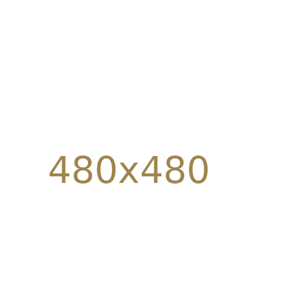
          </a>
          <figcaption>Metallicus-Laurea</figcaption>
        </figure>
        <figure class="greenwich-card">
          
          <figcaption>Metallicus-Corona</figcaption>
        </figure>
        <figure class="greenwich-card">
          
          <figcaption>Metallicus-Cervinus</figcaption>
        </figure>
        <figure class="greenwich-card">
          
          <figcaption>Metallicus-Arietinus</figcaption>
        </figure>
        <figure class="greenwich-card">
          
          <figcaption>Metallicus-Taurinus</figcaption>
        </figure>
      

    </section>
    <!-- Animal variants follow all other decorations for this armour part. -->
    <section class="greenwich-decoration-group" aria-labelledby="armet-animal-title">
      <h3 id="armet-animal-title">Animal</h3>
      

        <figure class="greenwich-card">
          
          <figcaption>Bear</figcaption>
        </figure>
        <figure class="greenwich-card">
          <a class="greenwich-image" href="images/armet/wolf.png" aria-label="Open wolf image">
            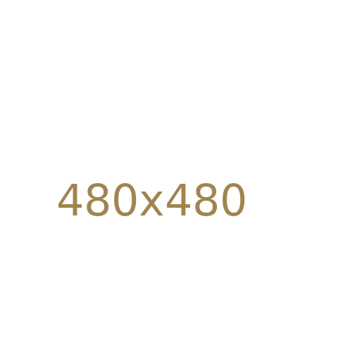
          </a>
          <figcaption>Wolf</figcaption>
        </figure>
      

    </section>
  </section>

  <!-- Noble Chestplate decorations -->
  <section id="chestplate" class="greenwich-section" aria-labelledby="chestplate-title">
    <h2 id="chestplate-title">Noble Chestplate decorations</h2>
    <section class="greenwich-decoration-group" aria-labelledby="chestplate-brackets-title">
      <h3 id="chestplate-brackets-title">Brackets</h3>
      

        <figure class="greenwich-card">
          <a class="greenwich-image" href="images/chestplate/brackets/insignia.png" aria-label="Open Insignia image">
            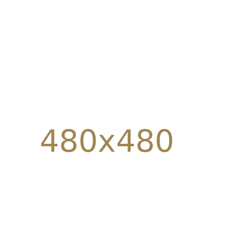
          </a>
          <figcaption>Insignia</figcaption>
        </figure>
        <figure class="greenwich-card">
          
          <figcaption>Pectorale</figcaption>
        </figure>
        <figure class="greenwich-card">
          
          <figcaption>Cingulum</figcaption>
        </figure>
        <figure class="greenwich-card">
          <a class="greenwich-image" href="images/chestplate/brackets/mantellum.png" aria-label="Open mantellum image">
            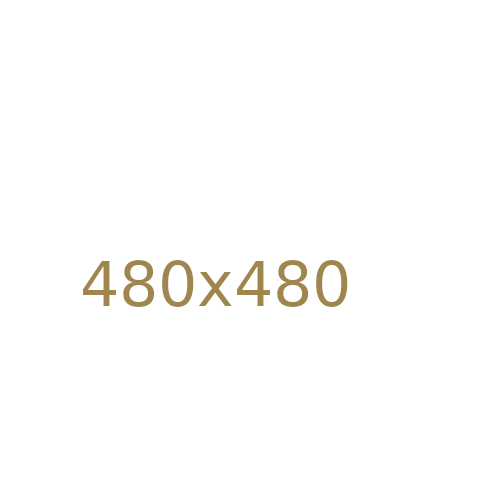
          </a>
          <figcaption>Mantellum</figcaption>
        </figure>
        <figure class="greenwich-card">
          
          <figcaption>Vexilium</figcaption>
        </figure>
        <figure class="greenwich-card">
          
          <figcaption>Balterus</figcaption>
        </figure>
      

    </section>
    <!-- Animal variants follow all other decorations for this armour part. -->
    <section class="greenwich-decoration-group" aria-labelledby="chestplate-animal-title">
      <h3 id="chestplate-animal-title">Animal</h3>
      

        <figure class="greenwich-card">
          
          <figcaption>Bear</figcaption>
        </figure>
        <figure class="greenwich-card">
          <a class="greenwich-image" href="images/chestplate/wolf.png" aria-label="Open wolf image">
            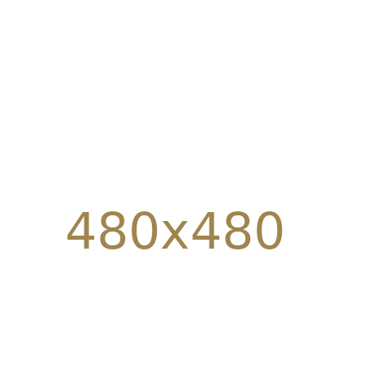
          </a>
          <figcaption>Wolf</figcaption>
        </figure>
      

    </section>
  </section>

  <!-- Noble Legplate decorations -->
  <section id="legplate" class="greenwich-section" aria-labelledby="legplate-title">
    <h2 id="legplate-title">Noble Legplate decorations</h2>
      

        
        <figure class="greenwich-card">
          <a class="greenwich-image" href="images/legplate/lacinia.png" aria-label="Open Lacinia image">
            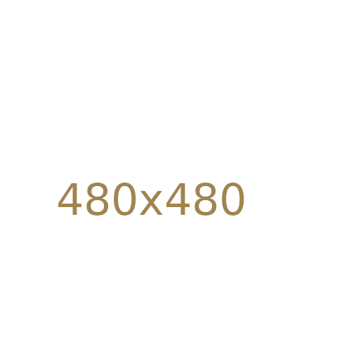
          </a>
          <figcaption>Lacinia</figcaption>
        </figure>
        <figure class="greenwich-card">
          
          <figcaption>Genuale</figcaption>
        </figure>
        <figure class="greenwich-card">
          
          <figcaption>Falda</figcaption>
        </figure>
      

    <!-- Animal variants follow all other decorations for this armour part. -->
    <section class="greenwich-decoration-group" aria-labelledby="legplate-animal-title">
      <h3 id="legplate-animal-title">Animal</h3>
      

        <figure class="greenwich-card">
          <a class="greenwich-image" href="images/legplate/bear.png" aria-label="Open bear image">
            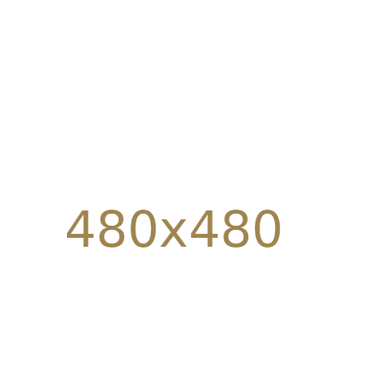
          </a>
          <figcaption>Bear</figcaption>
        </figure>
        <figure class="greenwich-card">
          <a class="greenwich-image" href="images/legplate/wolf.png" aria-label="Open wolf image">
            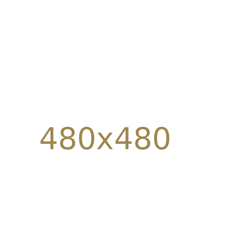
          </a>
          <figcaption>Wolf</figcaption>
        </figure>
      

    </section>
  </section>

  <!-- Material poses: three equal columns on desktop; stacked on narrow screens. -->
  

    <section class="greenwich-section greenwich-pose-section" aria-labelledby="iron-title">
      <h2 id="iron-title">Iron poses</h2>
      

      <figure class="greenwich-card">
        <a class="greenwich-image" href="images/poses/iron/ironpose1.png" aria-label="Open Iron — pose 1 image">
          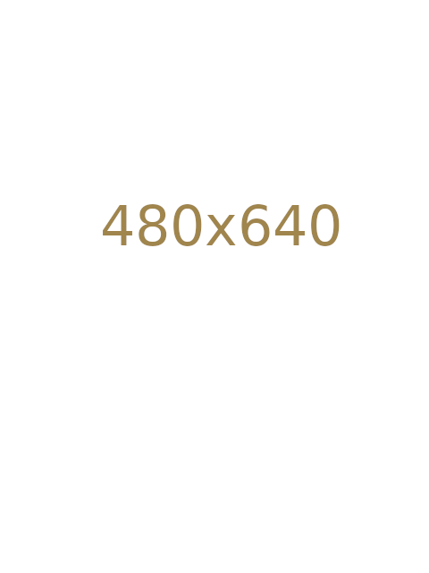
        </a>
        <figcaption>Iron — Pose 1</figcaption>
      </figure>
      <figure class="greenwich-card">
        <a class="greenwich-image" href="images/poses/iron/ironpose2.png" aria-label="Open Iron — pose 2 image">
          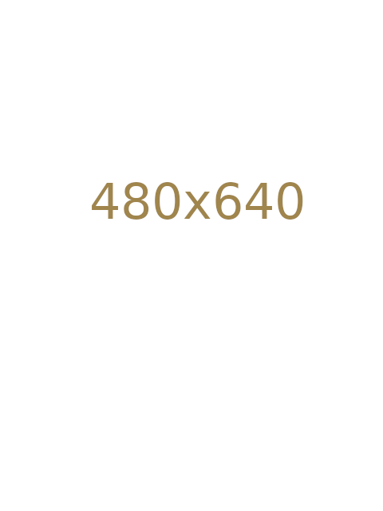
        </a>
        <figcaption>Iron — Pose 2</figcaption>
      </figure>
      

    </section>
    <section class="greenwich-section greenwich-pose-section" aria-labelledby="meteoric-iron-title">
      <h2 id="meteoric-iron-title">Meteoric iron poses</h2>
      

      <figure class="greenwich-card">
        <a class="greenwich-image" href="images/poses/meteoric-iron/meteoricironpose1.png" aria-label="Open Meteoric iron — pose 1 image">
          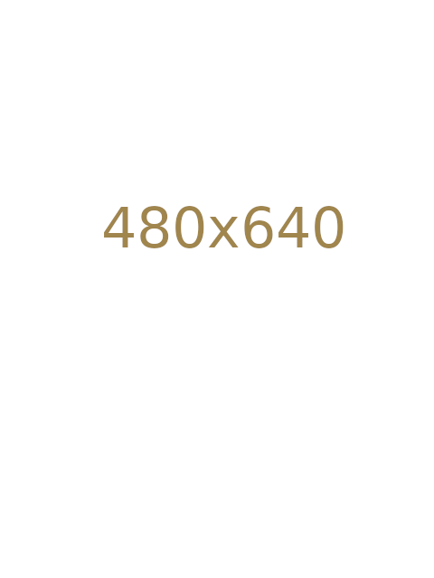
        </a>
        <figcaption>Meteoric Iron — Pose 1</figcaption>
      </figure>
      <figure class="greenwich-card">
        <a class="greenwich-image" href="images/poses/meteoric-iron/meteoricironpose2.png" aria-label="Open Meteoric iron — pose 2 image">
          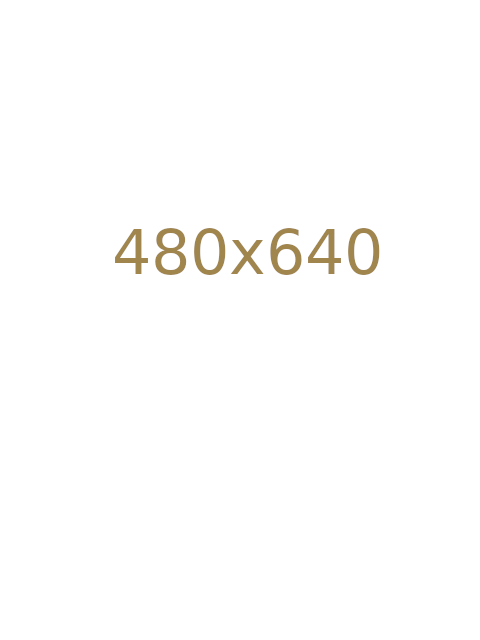
        </a>
        <figcaption>Meteoric Iron — Pose 2</figcaption>
      </figure>
      

    </section>
    <section class="greenwich-section greenwich-pose-section" aria-labelledby="steel-title">
      <h2 id="steel-title">Steel poses</h2>
      

      <figure class="greenwich-card">
        <a class="greenwich-image" href="images/poses/steel/steelpose1.png" aria-label="Open Steel — pose 1 image">
          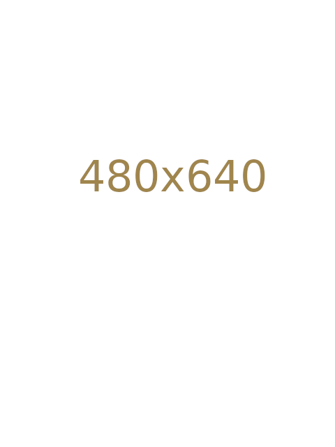
        </a>
        <figcaption>Steel — Pose 1</figcaption>
      </figure>
      <figure class="greenwich-card">
        <a class="greenwich-image" href="images/poses/steel/steelpose2.png" aria-label="Open Steel — pose 2 image">
          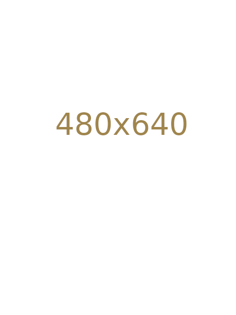
        </a>
        <figcaption>Steel — Pose 2</figcaption>
      </figure>
      

    </section>
  

  

    <a class="button" href="https://mods.vintagestory.at/show/mod/25550">Greenwich on ModDB ↗</a>
    <a href="#main">↑ Back to top</a>
  

