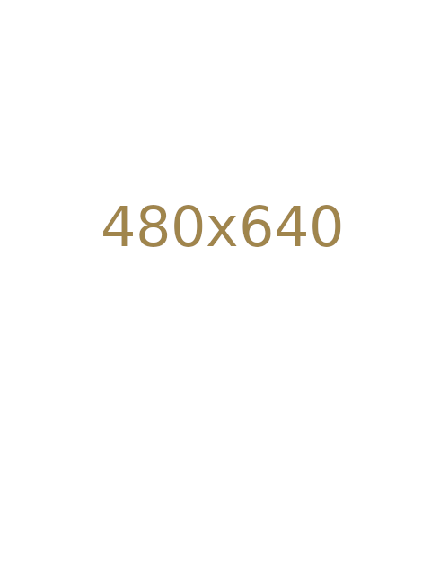

<link rel="stylesheet" href="{{ '/vintage-story/forgotten-armory/greenwich/greenwich.css' | relative_url }}">

  <a href="{{ '/vintage-story/forgotten-armory/' | relative_url }}">← Back to the armory</a>

  <section class="hero greenwich-hero">
    
FORGOTTEN ARMORY

    <h1>Greenwich</h1>
    
The plate set, its decorations and material poses.

  </section>

  <nav class="greenwich-navigation" aria-label="Greenwich sections">
    <a href="#introduction">Introduction</a>
    <a href="#armet">Armet Helmet</a>
    <a href="#chestplate">Noble Chestplate</a>
    <a href="#legplate">Noble Legplate</a>
    <a href="#poses">Poses</a>
  </nav>

  <!-- Introduction: the original wideshot is shown in full, without cropping. -->
  <section id="introduction" class="greenwich-section" aria-labelledby="introduction-title">
    <h2 id="introduction-title">Introduction</h2>
    <section aria-labelledby="plate-set-title">
      <h3 id="plate-set-title">Plate set</h3>
      
    </section>
  </section>

  <!-- Armet Helmet decorations -->
  <section id="armet" class="greenwich-section" aria-labelledby="armet-title">
    <h2 id="armet-title">Armet Helmet decorations</h2>
    

      <figure class="greenwich-card">
        
        <figcaption>Communis-Pennae</figcaption>
      </figure>
      <figure class="greenwich-card">
        
        <figcaption>Communis-Pluma</figcaption>
      </figure>
      <figure class="greenwich-card">
        
        <figcaption>Communis-Crista</figcaption>
      </figure>
    

  </section>

  <!-- Noble Chestplate decorations -->
  <section id="chestplate" class="greenwich-section" aria-labelledby="chestplate-title">
    <h2 id="chestplate-title">Noble Chestplate decorations</h2>
    

      <figure class="greenwich-card">
        
        <figcaption>Insignia</figcaption>
      </figure>
      <figure class="greenwich-card">
        
        <figcaption>Mantellum</figcaption>
      </figure>
    

  </section>

  <!-- Noble Legplate decorations -->
  <section id="legplate" class="greenwich-section" aria-labelledby="legplate-title">
    <h2 id="legplate-title">Noble Legplate decorations</h2>
    

      <figure class="greenwich-card">
        
        <figcaption>Lacinia</figcaption>
      </figure>
    

  </section>

  <!-- Material poses: three equal columns on desktop; stacked on narrow screens. -->
  

    <section class="greenwich-section greenwich-pose-section" aria-labelledby="iron-title">
      <h2 id="iron-title">Iron poses</h2>
      

      <figure class="greenwich-card">
        
        <figcaption>Iron — pose 1</figcaption>
      </figure>
      <figure class="greenwich-card">
        
        <figcaption>Iron — pose 2</figcaption>
      </figure>
      

    </section>
    <section class="greenwich-section greenwich-pose-section" aria-labelledby="meteoric-iron-title">
      <h2 id="meteoric-iron-title">Meteoric iron poses</h2>
      

      <figure class="greenwich-card">
        
        <figcaption>Meteoric iron — pose 1</figcaption>
      </figure>
      <figure class="greenwich-card">
        
        <figcaption>Meteoric iron — pose 2</figcaption>
      </figure>
      

    </section>
    <section class="greenwich-section greenwich-pose-section" aria-labelledby="steel-title">
      <h2 id="steel-title">Steel poses</h2>
      

      <figure class="greenwich-card">
        
        <figcaption>Steel — pose 1</figcaption>
      </figure>
      <figure class="greenwich-card">
        
        <figcaption>Steel — pose 2</figcaption>
      </figure>
      

    </section>
  

  

    <a class="button" href="https://mods.vintagestory.at/show/mod/25550">Greenwich on ModDB ↗</a>
    <a href="#main">↑ Back to top</a>
  

