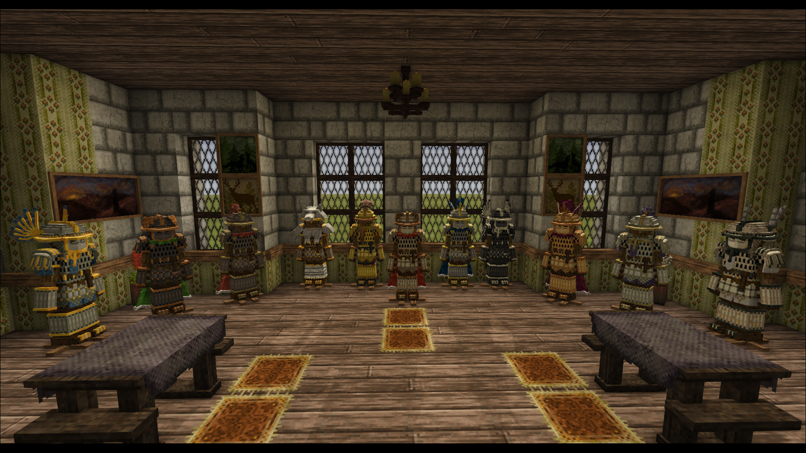
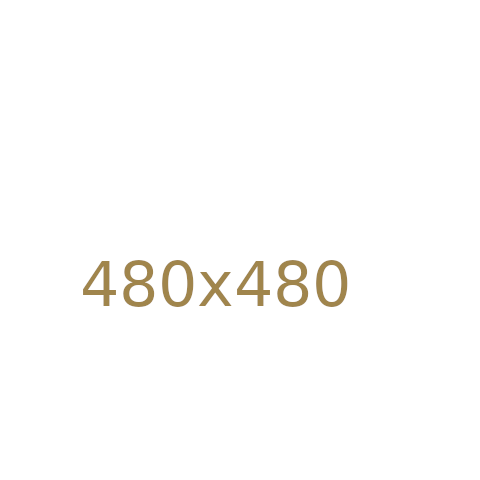
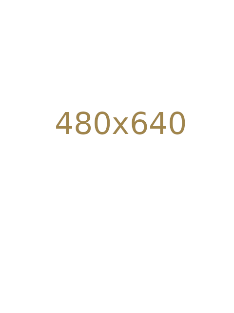

<link rel="stylesheet" href="{{ '/vintage-story/forgotten-armory/viking/viking.css' | relative_url }}">

<a href="{{ '/vintage-story/forgotten-armory/' | relative_url }}">← Forgotten Armory</a>

<header class="viking-hero">
FORGOTTEN ARMORY · COLLECTION
<h1>Viking</h1>
Bjarnholdr and Ragnjorn sets, decorations and material poses.
</header>
<nav class="viking-navigation" aria-label="Viking sections"><a href="#introduction">Introduction</a><a href="#bjarnholdr-helmet">Bjarnholdr helmet</a><a href="#bjarnholdr-chestplate">Bjarnholdr chestplate</a><a href="#bjarnholdr-legplate">Bjarnholdr legplate</a><a href="#ragnjorn-helmet">Ragnjorn helmet</a><a href="#ragnjorn-chestplate">Ragnjorn chestplate</a><a href="#ragnjorn-legplate">Ragnjorn legplate</a><a href="#poses">Poses</a></nav>
<section id="introduction" class="viking-section" aria-labelledby="introduction-title"><h2 id="introduction-title">Introduction</h2>
Template gallery: decoration and pose images are placeholders; wideshots are temporary references.

<figure class="viking-card" id="bjarnholdr-set">
            
            <figcaption>Bjarnholdr — Plate set</figcaption>
          </figure>
          <figure class="viking-card" id="ragnjorn-set">
            
            <figcaption>Ragnjorn — Chain set</figcaption>
          </figure>
          
</section>
<section id="bjarnholdr-helmet" class="viking-section" aria-labelledby="bjarnholdr-helmet-title">
  <h2 id="bjarnholdr-helmet-title">Bjarnholdr — Plate Helmet decorations</h2>
  
Decoration variants.

  

    <h3>Communis</h3>
    

          <figure class="viking-card">
            
            <figcaption>Communis-Pennae</figcaption>
          </figure>
          <figure class="viking-card">
            
            <figcaption>Communis-Pluma</figcaption>
          </figure>
          <figure class="viking-card">
            
            <figcaption>Communis-Crista</figcaption>
          </figure>
          <figure class="viking-card">
            
            <figcaption>Communis-Pinna</figcaption>
          </figure>
          <figure class="viking-card">
            
            <figcaption>Communis-Sertum</figcaption>
          </figure>
          <figure class="viking-card">
            
            <figcaption>Communis-Transversa</figcaption>
          </figure>
          <figure class="viking-card">
            
            <figcaption>Communis-Vexillum</figcaption>
          </figure>
          <figure class="viking-card">
            
            <figcaption>Communis-Cauda</figcaption>
          </figure>
    

  

  

    <h3>Regalis</h3>
    

          <figure class="viking-card">
            
            <figcaption>Regalis-Crista</figcaption>
          </figure>
          <figure class="viking-card">
            
            <figcaption>Regalis-Transversa</figcaption>
          </figure>
          <figure class="viking-card">
            
            <figcaption>Regalis-Pennae</figcaption>
          </figure>
          <figure class="viking-card">
            
            <figcaption>Regalis-Pinna</figcaption>
          </figure>
          <figure class="viking-card">
            
            <figcaption>Regalis-Pluma</figcaption>
          </figure>
          <figure class="viking-card">
            
            <figcaption>Regalis-Sertum</figcaption>
          </figure>
          <figure class="viking-card">
            
            <figcaption>Regalis-Vexillum</figcaption>
          </figure>
          <figure class="viking-card">
            
            <figcaption>Regalis-Cauda</figcaption>
          </figure>
    

  

  

    <h3>Metallicus</h3>
    

          <figure class="viking-card">
            
            <figcaption>Metallicus-Laurea</figcaption>
          </figure>
          <figure class="viking-card">
            
            <figcaption>Metallicus-Corona</figcaption>
          </figure>
          <figure class="viking-card">
            
            <figcaption>Metallicus-Cervinus</figcaption>
          </figure>
          <figure class="viking-card">
            
            <figcaption>Metallicus-Arietinus</figcaption>
          </figure>
          <figure class="viking-card">
            
            <figcaption>Metallicus-Taurinus</figcaption>
          </figure>
    

  

  

    <h3>Animal</h3>
    

          <figure class="viking-card">
            
            <figcaption>Animal-Bear</figcaption>
          </figure>
          <figure class="viking-card">
            
            <figcaption>Animal-Wolf</figcaption>
          </figure>
    

  

</section>
<section id="bjarnholdr-chestplate" class="viking-section" aria-labelledby="bjarnholdr-chestplate-title">
  <h2 id="bjarnholdr-chestplate-title">Bjarnholdr — Plate Chestplate decorations</h2>
  
Decoration variants.

  

    <h3>Brackets</h3>
    

          <figure class="viking-card">
            
            <figcaption>Brackets-Insignia</figcaption>
          </figure>
          <figure class="viking-card">
            
            <figcaption>Brackets-Pectorale</figcaption>
          </figure>
          <figure class="viking-card">
            
            <figcaption>Brackets-Cingulum</figcaption>
          </figure>
          <figure class="viking-card">
            
            <figcaption>Brackets-Mantellum</figcaption>
          </figure>
          <figure class="viking-card">
            
            <figcaption>Brackets-Vexilium</figcaption>
          </figure>
          <figure class="viking-card">
            
            <figcaption>Brackets-Balterus</figcaption>
          </figure>
    

  

  

    <h3>Animal</h3>
    

          <figure class="viking-card">
            
            <figcaption>Animal-Bear</figcaption>
          </figure>
          <figure class="viking-card">
            
            <figcaption>Animal-Wolf</figcaption>
          </figure>
    

  

</section>
<section id="bjarnholdr-legplate" class="viking-section" aria-labelledby="bjarnholdr-legplate-title">
  <h2 id="bjarnholdr-legplate-title">Bjarnholdr — Plate Legplate decorations</h2>
  
Decoration variants.

  

    <h3>Decorations</h3>
    

          <figure class="viking-card">
            
            <figcaption>Lacinia</figcaption>
          </figure>
          <figure class="viking-card">
            
            <figcaption>Genuale</figcaption>
          </figure>
          <figure class="viking-card">
            
            <figcaption>Falda</figcaption>
          </figure>
    

  

  

    <h3>Animal</h3>
    

          <figure class="viking-card">
            
            <figcaption>Animal-Bear</figcaption>
          </figure>
          <figure class="viking-card">
            
            <figcaption>Animal-Wolf</figcaption>
          </figure>
    

  

</section>

<section id="ragnjorn-helmet" class="viking-section" aria-labelledby="ragnjorn-helmet-title">
  <h2 id="ragnjorn-helmet-title">Ragnjorn — Chain Helmet decorations</h2>
  
Decoration variants.

  

    <h3>Communis</h3>
    

          <figure class="viking-card">
            
            <figcaption>Communis-Pennae</figcaption>
          </figure>
          <figure class="viking-card">
            
            <figcaption>Communis-Pluma</figcaption>
          </figure>
          <figure class="viking-card">
            
            <figcaption>Communis-Crista</figcaption>
          </figure>
          <figure class="viking-card">
            
            <figcaption>Communis-Pinna</figcaption>
          </figure>
          <figure class="viking-card">
            
            <figcaption>Communis-Sertum</figcaption>
          </figure>
          <figure class="viking-card">
            
            <figcaption>Communis-Transversa</figcaption>
          </figure>
          <figure class="viking-card">
            
            <figcaption>Communis-Vexillum</figcaption>
          </figure>
          <figure class="viking-card">
            
            <figcaption>Communis-Cauda</figcaption>
          </figure>
    

  

  

    <h3>Regalis</h3>
    

          <figure class="viking-card">
            
            <figcaption>Regalis-Crista</figcaption>
          </figure>
          <figure class="viking-card">
            
            <figcaption>Regalis-Transversa</figcaption>
          </figure>
          <figure class="viking-card">
            
            <figcaption>Regalis-Pennae</figcaption>
          </figure>
          <figure class="viking-card">
            
            <figcaption>Regalis-Pinna</figcaption>
          </figure>
          <figure class="viking-card">
            
            <figcaption>Regalis-Pluma</figcaption>
          </figure>
          <figure class="viking-card">
            
            <figcaption>Regalis-Sertum</figcaption>
          </figure>
          <figure class="viking-card">
            
            <figcaption>Regalis-Vexillum</figcaption>
          </figure>
          <figure class="viking-card">
            
            <figcaption>Regalis-Cauda</figcaption>
          </figure>
    

  

  

    <h3>Metallicus</h3>
    

          <figure class="viking-card">
            
            <figcaption>Metallicus-Laurea</figcaption>
          </figure>
          <figure class="viking-card">
            
            <figcaption>Metallicus-Corona</figcaption>
          </figure>
          <figure class="viking-card">
            
            <figcaption>Metallicus-Cervinus</figcaption>
          </figure>
          <figure class="viking-card">
            
            <figcaption>Metallicus-Arietinus</figcaption>
          </figure>
          <figure class="viking-card">
            
            <figcaption>Metallicus-Taurinus</figcaption>
          </figure>
    

  

  

    <h3>Animal</h3>
    

          <figure class="viking-card">
            
            <figcaption>Animal-Bear</figcaption>
          </figure>
          <figure class="viking-card">
            
            <figcaption>Animal-Wolf</figcaption>
          </figure>
    

  

</section>
<section id="ragnjorn-chestplate" class="viking-section" aria-labelledby="ragnjorn-chestplate-title">
  <h2 id="ragnjorn-chestplate-title">Ragnjorn — Chain Chestplate decorations</h2>
  
Decoration variants.

  

    <h3>Brackets</h3>
    

          <figure class="viking-card">
            
            <figcaption>Brackets-Insignia</figcaption>
          </figure>
          <figure class="viking-card">
            
            <figcaption>Brackets-Pectorale</figcaption>
          </figure>
          <figure class="viking-card">
            
            <figcaption>Brackets-Cingulum</figcaption>
          </figure>
          <figure class="viking-card">
            
            <figcaption>Brackets-Mantellum</figcaption>
          </figure>
          <figure class="viking-card">
            
            <figcaption>Brackets-Vexilium</figcaption>
          </figure>
          <figure class="viking-card">
            
            <figcaption>Brackets-Balterus</figcaption>
          </figure>
    

  

  

    <h3>Animal</h3>
    

          <figure class="viking-card">
            
            <figcaption>Animal-Bear</figcaption>
          </figure>
          <figure class="viking-card">
            
            <figcaption>Animal-Wolf</figcaption>
          </figure>
    

  

</section>
<section id="ragnjorn-legplate" class="viking-section" aria-labelledby="ragnjorn-legplate-title">
  <h2 id="ragnjorn-legplate-title">Ragnjorn — Chain Legplate decorations</h2>
  
Decoration variants.

  

    <h3>Decorations</h3>
    

          <figure class="viking-card">
            
            <figcaption>Lacinia</figcaption>
          </figure>
          <figure class="viking-card">
            
            <figcaption>Genuale</figcaption>
          </figure>
          <figure class="viking-card">
            
            <figcaption>Falda</figcaption>
          </figure>
    

  

  

    <h3>Animal</h3>
    

          <figure class="viking-card">
            
            <figcaption>Animal-Bear</figcaption>
          </figure>
          <figure class="viking-card">
            
            <figcaption>Animal-Wolf</figcaption>
          </figure>
    

  

</section>

<section id="poses" class="viking-section viking-pose-category" aria-labelledby="poses-title">
  <h2 id="poses-title">Material poses</h2>
  
Guard and Captain sets in iron, meteoric iron and steel.

  <section class="viking-pose-row" id="bjarnholdr-poses">
    <h3>Bjarnholdr — Plate set</h3>
    

      <section class="viking-pose-metal">
        <h4>Iron</h4>
        

          <figure class="viking-card">
            
            <figcaption>Bjarnholdr Iron — Pose 1</figcaption>
          </figure>
          <figure class="viking-card">
            
            <figcaption>Bjarnholdr Iron — Pose 2</figcaption>
          </figure>
        

      </section>
      <section class="viking-pose-metal">
        <h4>Meteoric iron</h4>
        

          <figure class="viking-card">
            
            <figcaption>Bjarnholdr Meteoric iron — Pose 1</figcaption>
          </figure>
          <figure class="viking-card">
            
            <figcaption>Bjarnholdr Meteoric iron — Pose 2</figcaption>
          </figure>
        

      </section>
      <section class="viking-pose-metal">
        <h4>Steel</h4>
        

          <figure class="viking-card">
            
            <figcaption>Bjarnholdr Steel — Pose 1</figcaption>
          </figure>
          <figure class="viking-card">
            
            <figcaption>Bjarnholdr Steel — Pose 2</figcaption>
          </figure>
        

      </section>
    

  </section>
  <section class="viking-pose-row" id="ragnjorn-poses">
    <h3>Ragnjorn — Chain set</h3>
    

      <section class="viking-pose-metal">
        <h4>Iron</h4>
        

          <figure class="viking-card">
            
            <figcaption>Ragnjorn Iron — Pose 1</figcaption>
          </figure>
          <figure class="viking-card">
            
            <figcaption>Ragnjorn Iron — Pose 2</figcaption>
          </figure>
        

      </section>
      <section class="viking-pose-metal">
        <h4>Meteoric iron</h4>
        

          <figure class="viking-card">
            
            <figcaption>Ragnjorn Meteoric iron — Pose 1</figcaption>
          </figure>
          <figure class="viking-card">
            
            <figcaption>Ragnjorn Meteoric iron — Pose 2</figcaption>
          </figure>
        

      </section>
      <section class="viking-pose-metal">
        <h4>Steel</h4>
        

          <figure class="viking-card">
            
            <figcaption>Ragnjorn Steel — Pose 1</figcaption>
          </figure>
          <figure class="viking-card">
            
            <figcaption>Ragnjorn Steel — Pose 2</figcaption>
          </figure>
        

      </section>
    

  </section>
</section>

  <section class="note">

    
Return to the full Forgotten Armory directory.

    <a href="{{ '/vintage-story/forgotten-armory/' | relative_url }}">Forgotten Armory ←</a>
  
</section>
  <section class="note">

    
Find Aladar’s mods on Vintage Story ModDB.

    <a href="https://mods.vintagestory.at/show/user/922a98ad603bda6d92eb">All mods on ModDB ↗</a>
  
</section>

